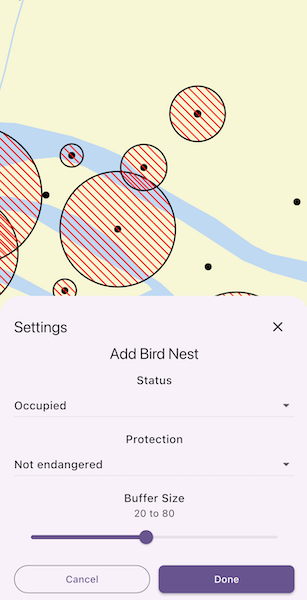

# Add features with contingent values

Create and add features whose attribute values satisfy a predefined set of contingencies.

## Use case

Contingent values are a data design feature that allow you to make values in one field dependent on values in another field. Your choice for a value on one field further constrains the domain values that can be placed on another field. In this way, contingent values enforce data integrity by applying additional constraints to reduce the number of valid field inputs.

For example, a field crew working in a sensitive habitat area may be required to stay a certain distance away from occupied bird nests, but the size of that exclusion area differs depending on the bird's level of protection according to presiding laws. Surveyors can add points of bird nests in the work area and their selection of the size of the exclusion area will be contingent on the values in other attribute fields.

## How to use the sample

Tap on the map to add a feature symbolizing a bird's nest. Then choose values describing the nest's status, protection, and buffer size. Notice how different values are available depending on the values of preceding fields. Once the contingent values are validated, tap "Done" to add the feature to the map.

## How it works

1. Create and load the `Geodatabase` from the mobile geodatabase location on file.
2. Load the `ArcGISFeatureTable` from the geodatabase using `Geodatabase.getGeodatabaseFeatureTable(...)`.
3. Load the `ContingentValuesDefinition` from the feature table using `ArcGISFeatureTable.contingentValuesDefinition.load()`.
4. Create a new `FeatureLayer` from the feature table and add it to the map.
5. Create a new `ArcGISFeature` from the feature table using `ArcGISFeatureTable.createFeature(...)`.
6. Get a field from the feature table by name using `ArcGISFeatureTable.fields`.
7. Retrieve the domain from the field as a `CodedValueDomain`.
8. Get the coded value domain’s `codedValues` to obtain a list of `CodedValue` objects.
9. After selecting a value from the initial coded values for the first field, retrieve the remaining valid contingent values for each field as values are selected:  
  i. Get the `ContingentValuesResult` by using `ArcGISFeatureTable.getContingentValues(feature, fieldName)`.
  ii. Get an array of valid `ContingentValue` objects from the `contingentValuesByFieldGroup` map using the name of the relevant field group.
  iii. Iterate through the array of valid contingent values to create an array of `ContingentCodedValue` names or the minimum and maximum values of a `ContingentRangeValue` depending on the type of `ContingentValue` returned.
10. Validate the feature’s contingent values by using `ArcGISFeatureTable.validateContingencyConstraints(feature)`.
  If the resulting collection is empty, the selected values are valid.
11. Generate buffer geometries using `GeometryEngine.buffer(...)` and display them using a `GraphicsOverlay`.
12. Add the feature to the feature table using `ArcGISFeatureTable.addFeature(...)`.
13. Query the feature table using `ArcGISFeatureTable.queryFeatures(...)` and update the displayed buffer graphics.

## Relevant API

* ArcGISFeatureTable
* CodedValue
* CodedValueDomain
* ContingencyConstraintViolation
* ContingentCodedValue
* ContingentRangeValue
* ContingentValuesDefinition
* ContingentValuesResult

## Offline data

This sample uses the [Contingent values birds nests](https://arcgis.com/home/item.html?id=e12b54ea799f4606a2712157cf9f6e41) mobile geodatabase and the [Fillmore topographic map](https://arcgis.com/home/item.html?id=b5106355f1634b8996e634c04b6a930a) vector tile package for the basemap.

## About the data

The mobile geodatabase contains birds nests in the Fillmore area, defined with contingent values. Each feature contains information about its status, protection, and buffer size.

## Additional information

Learn more about contingent values and how to utilize them on the [ArcGIS Pro documentation](https://pro.arcgis.com/en/pro-app/latest/help/data/geodatabases/overview/contingent-values.htm).

## Tags

coded values, contingent values, feature table, geodatabase
