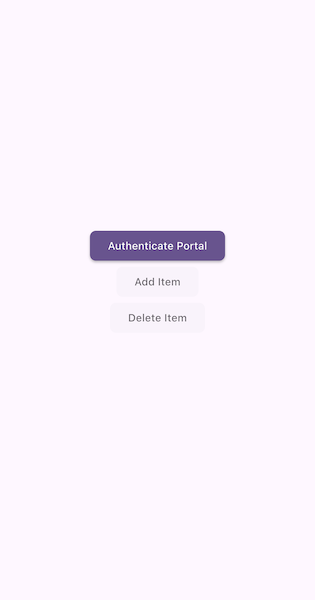

# Add items to portal

This sample demonstrates how to add and delete items in a user's portal.

## Use case

Portals allow you to share and publish data with others. This sample creates a CSV item and uploads it to ArcGIS Online.

## How to use the sample

1. Tap the "Authenticate Portal" button and sign into your ArcGIS Online account.
2. Tap the "Add Item" button to add the CSV to your portal.
3. Tap the "Delete Item" button to delete that item from your portal.

## How it works

1. Add an `Authenticator` widget (from the Toolkit) to handle the authentication workflow.
2. Create a new `Portal` and load it to invoke the authentication challenge.
3. Once authenticated, create a `PortalItem` of type `PortalItemType.csv`.
4. Add the item with `PortalUser.addPortalItem` and supply the CSV file data.
5. Access the newly-created item's properties, such as `item.itemId`.
6. Delete the item with `PortalUser.deletePortalItem`.

## Relevant API

* Portal
* PortalItem
* PortalUser.addPortalItem
* PortalUser.deletePortalItem

## Tags

add item, cloud, portal
