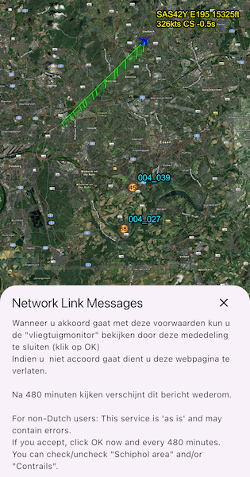

# Add KML layer with network links

Display a file with a KML network link, including displaying any network link control messages at launch.

## Use case

KML files can reference other KML files on the network and support automatically refreshing content. For example, survey workers will benefit from KML data shown on their devices automatically refreshing to show the most up-to-date state. Additionally, discovering KML files linked to the data they are currently viewing provides additional information to make better decisions in the field.

## How to use the sample

The sample will load the KML file automatically. The data shown should refresh automatically every few seconds. Pan and zoom to explore the scene.

## How it works

1. Create a `KmlDataset` from a KML source which has network links.
2. Construct a `KmlLayer` with the dataset and add the layer as an operational layer.
3. To listen for network messages, listen to the dataset's `onNetworkLinkMessageReceived` stream.

## Relevant API

* KmlDataset
* KmlDataset.onNetworkLinkMessageReceived
* KmlLayer

## About the data

This scene shows the current air traffic in parts of Europe with heading, altitude, and ground speed. Additionally, noise levels from ground monitoring stations are shown.

This sample uses the radar.kmz file, which can be found on [ArcGIS Online](https://arcgisruntime.maps.arcgis.com/home/item.html?id=600748d4464442288f6db8a4ba27dc95).

## Tags

Keyhole, KML, KMZ, network link, network link control, OGC
