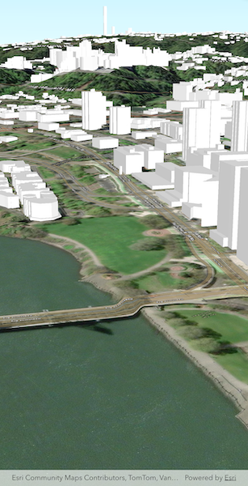

# Add scene layer from service

Display an ArcGIS scene layer from a URL.

## Use case

Adding a scene layer from a URL allows you to author the scene layer elsewhere in the platform, say with ArcGIS Pro or CityEngine, and then add that scene layer to a scene in ArcGIS Maps SDK. Loading a scene layer from a URL also permits the layer source to change dynamically without updating the code. Each scene layer added to a scene can assist in performing helpful visual analysis. For example, if presenting the results of a shadow analysis of a major metropolitan downtown area in 3D, adding a scene layer of 3D buildings to the scene that could be toggled on/off would help to better contextualize the source of the shadows.

## How to use the sample

Pan and zoom to explore the scene.

## How it works

1. Create an `ArcGISScene`.
2. Create an `ArcGISTiledElevationSource` object and add it to the scene's base surface.
3. Create an `ArcGISSceneLayer` passing in the URL to a scene layer service.
4. Add the scene layer to the scene's operational layers.

## Relevant API

* ArcGISScene
* ArcGISSceneLayer
* ArcGISTiledElevationSource

## About the data

This sample shows data from [Esri 3D Buildings](https://www.arcgis.com/home/item.html?id=b8fec5af7dfe4866b1b8ac2d2800f282) in Portland, Oregon.

## Tags

3D, buildings, model, Portland, scene, service, URL
