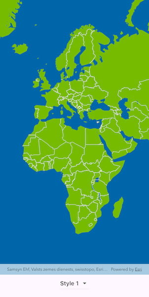

# Add vector tiled layer from custom style

Load an ArcGIS vector tiled layers using custom styles.

## Use case

Vector tile basemaps can be created in ArcGIS Pro and published as offline packages or online services. You can create a custom style tailored to your needs and easily apply it to your map. `ArcGISVectorTiledLayer` has many advantages over traditional raster-based basemaps (`ArcGISTiledLayer`), including smooth scaling between different screen DPIs, smaller package sizes, and the ability to rotate symbols and labels dynamically.

## How to use the sample

Pan and zoom to explore the vector tile basemap. Select a theme to see it applied to the vector tile basemap.

## How it works

1. Create an `ArcGISVectorTiledLayer` from an ArcGIS Online custom style item.
2. Alternatively, create an `ArcGISVectorTiledLayer` by taking a style item offline and applying it to a local vector tile package:
    1. Create a `PortalItem` for the selected style.
    2. Create an `ExportVectorTilesTask` with that `PortalItem`.
    3. Create and run an `ExportVectorTilesJob` using `ExportVectorTilesTask.exportStyleResourceCache`.
    4. Create a `VectorTileCache` from the local `.vtpk` file.
    5. Create an `ArcGISVectorTiledLayer` with `ArcGISVectorTiledLayer.withVectorTileCache`, passing the `ItemResourceCache` from the job result.
3. Create a `Basemap` from the layer and assign it to the map's `basemap`.

## Relevant API

* ArcGISMap
* ArcGISVectorTiledLayer
* ExportVectorTilesTask
* ItemResourceCache
* VectorTileCache

## Offline data

[Dodge City OSM vector tile package](https://www.arcgis.com/home/item.html?id=f4b742a57af344988b02227e2824ca5f)

## Tags

tiles, vector, vector basemap, vector tile package, vector tiled layer, vector tiles, vtpk
