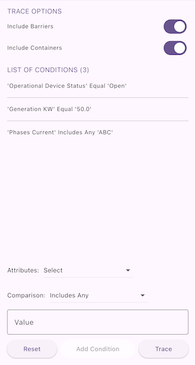

# Analyze network with subnetwork trace

Get a server-defined trace configuration for a given tier and modify its traversability scope, add new condition barriers, and control what is included in the subnetwork trace result.

## Use case

While some traces are built from an ad-hoc group of parameters, many are based on a variation of the trace configuration taken from the subnetwork definition. For example, an electrical trace will be based on the trace configuration of the subnetwork, but may add additional clauses to constrain the trace along a single phase. Similarly, a trace in a gas or electric design application may include features with a status of "In Design" that are normally excluded from trace results.

## How to use the sample

1. The sample loads with the default trace configuration for a chosen tier.
2. Toggle inclusions (containers, barriers, associations, etc.).
3. Define a conditional network attribute comparison with the 'Attributes' and 'Comparison' dropdowns.
4. Tap "Add condition" to append the condition to the barrier expression.
5. Tap "Trace" to run a subnetwork trace from the predefined starting location using the modified configuration.
6. Tap "Reset" to restore the original server-provided barrier expression.

Example barrier conditions for the default dataset:

* `Transformer Load` Equal `15`
* `Phases Current` DoesNotIncludeTheValues `A`
* `Generation KW` LessThan `50`

## How it works

1. Instantiate a `ServiceGeodatabase` from the feature service URL.
2. Create and load a `UtilityNetwork` from the service geodatabase; look up the required `UtilityAssetType` and `UtilityTier` by name.
3. Populate the comparison source list with non-system `definition.networkAttributes`, and the operator list from `UtilityAttributeComparisonOperator` enum values.
4. Build a default starting `UtilityElement` from the selected asset type.
5. Initialize UI options and the barrier expression from the tier's `TraceConfiguration`.
6. When a network attribute is chosen, if its `Domain` is a `CodedValueDomain`, populate the value list from its coded values; otherwise present a free-form input.
7. On "Add condition", create a `UtilityNetworkAttributeComparison` (source, operator, value), coercing the value to the source attribute's `UtilityNetworkAttribute.dataType`.
8. If existing `UtilityTraversability.barriers` are present, combine them and the new comparison in a `UtilityTraceOrCondition`.
9. On "Trace", create `UtilityTraceParameters` (`UtilityTraceType.subnetwork`, starting element), apply modified options and expression in its `TraceConfiguration`, then execute `UtilityNetwork.trace`.
10. On "Reset", restore the original barrier expression.
11. Present the count of returned `UtilityElementTraceResult` list.

## Relevant API

* CodedValueDomain
* UtilityAssetType
* UtilityCategory
* UtilityCategoryComparison
* UtilityCategoryComparisonOperator
* UtilityDomainNetwork
* UtilityElement
* UtilityElementTraceResult
* UtilityNetwork
* UtilityNetworkAttribute
* UtilityNetworkAttributeComparison
* UtilityNetworkAttributeComparison.withValue
* UtilityNetworkDefinition
* UtilityTerminal
* UtilityTier
* UtilityTraceAndCondition
* UtilityTraceConfiguration
* UtilityTraceOrCondition
* UtilityTraceParameters
* UtilityTraceResult
* UtilityTraceType
* UtilityTraversability

## About the data

The [Naperville Electric](https://sampleserver7.arcgisonline.com/server/rest/services/UtilityNetwork/NapervilleElectric/FeatureServer) utility network feature service (authentication required; handled in code) provides the subnetwork and tier definitions used for this trace.

## Additional information

Using a utility network on ArcGIS Enterprise 10.8 requires an Enterprise member account licensed with the [Utility Network user type extension](https://enterprise.arcgis.com/en/portal/latest/administer/windows/license-user-type-extensions.htm#ESRI_SECTION1_41D78AD9691B42E0A8C227C113C0C0BF). See the [utility network services documentation](https://enterprise.arcgis.com/en/server/latest/publish-services/windows/utility-network-services.htm) for publishing and configuration details.

## Tags

category comparison, condition barriers, network analysis, network attribute comparison, subnetwork trace, trace configuration, traversability, utility network, validate consistency
