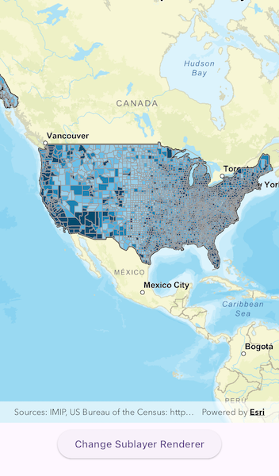

# Apply class breaks renderer to sublayer

Apply a renderer to a sublayer.

## Use case

A layer showing animal populations contains sublayers for different species. A renderer could be applied which gives each sublayer a different color, so that populations of each species can be compared visually.

## How to use the sample

Wait for the map image layer to load. Tap the 'Change Sublayer Renderer' button to apply a unique value renderer to see different population ranges in the counties sub-layer data.

## How it works

1. Create an `ArcGISMapImageLayer` from its URL.
2. After it is done loading, get its list of `ArcGISMapImageSublayer` objects with `imageLayer.arcGISMapImageSublayers`.
3. Access the sublayer you want: `imageLayer.arcGISMapImageSublayers.elementAt(2)`.
4. Create a `ClassBreaksRenderer` with a collection of `ClassBreak`s for different population ranges.
5. Set the renderer of the sublayer with `sublayer.renderer = renderer`.

## Relevant API

* ArcGISMapImageLayer
* ArcGISMapImageSublayer
* ClassBreaksRenderer
* ClassBreaksRenderer.ClassBreak  

## About the data

This application displays census data from an ArcGIS Server map service. It contains various population statistics, including total population for each county in 2007.

## Additional information

The service hosting the layer must support dynamic layers to be able to change the rendering of sublayers.

## Tags

class breaks, dynamic layer, dynamic rendering, renderer, sublayer, symbology, visualization
