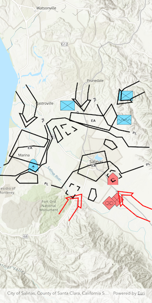

# Apply dictionary renderer to feature layer

Convert features into graphics to show them with mil2525d symbols.

## Use case

A dictionary renderer uses a style file along with a rule engine to display advanced symbology.
This is useful for displaying features using precise military symbology.

## How to use the sample

Pan and zoom around the map. Observe the displayed military symbology on the map.

## How it works

1. Create a `Geodatabase` using `Geodatabase.withFileUr()`.
2. Load the geodatabase using `Geodatabase.load()`.
3. Instantiate a `DictionarySymbolStyle` using `DictionarySymbolStyle.withFileUri()`.
4. Load the dictionary symbol style using `DictionarySymbolStyle.load()`.
5. Cycle through each `GeodatabaseFeatureTable` from the geodatabase using `Geodatabase.geodatabaseFeatureTables`.
6. Create a `FeatureLayer` from each table within the geodatabase using `FeatureLayer.withFeatureTable()`.
7. Create a `DictionaryRenderer` and assign it to each feature layer using `featureLayer.renderer = dictionaryRenderer`.
8. Add the feature layers to the map using `ArcGISMap.operationalLayers.addAll()`.
9. Load the feature layers with `FeatureLayer.load()`.
10. After the layers have loaded, create a new extent from the union of all layer extents.
11. Set that extent as the map view viewpoint using `ArcGISMapViewController.setViewpoint()`.

## Relevant API

* DictionaryRenderer
* DictionarySymbolStyle

## Offline data

This sample uses the [mil2525d stylx file](https://www.arcgis.com/home/item.html?id=c78b149a1d52414682c86a5feeb13d30)
and the [military overlay geodatabase](https://www.arcgis.com/home/item.html?id=e0d41b4b409a49a5a7ba11939d8535dc).
They are downloaded from ArcGIS Online as part of the sample.

## Tags

military, symbol
