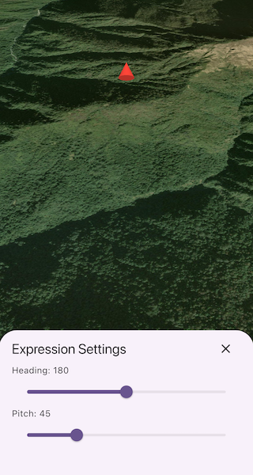

# Apply scene property expressions

Update the orientation of a graphic using expressions based on its attributes.

## Use case

Instead of reading the attribute and changing the rotation on the symbol for a single graphic (a manual CPU operation), you can bind the rotation to an expression that applies to the whole overlay (an automatic GPU operation). This usually results in a noticeable performance boost (smooth rotations).

## How to use the sample

Adjust the heading and pitch sliders to rotate the cone.

## How it works

1. Create a graphics overlay.
2. Create a simple renderer and configure its scene property expressions.
3. Set the heading expression to `[HEADING]` and the pitch expression to `[PITCH]`.
4. Apply the renderer to the graphics overlay.
5. Create a graphic with `HEADING` and `PITCH` attributes and add it to the overlay.
6. Display the graphics overlay in a scene view.
7. To update the graphic's rotation, modify the `HEADING` or `PITCH` attribute using the controls in the Settings panel.

## Relevant API

* Graphic.attributes
* GraphicsOverlay
* SceneProperties
* SceneProperties.headingExpression
* SceneProperties.pitchExpression
* SimpleRenderer
* SimpleRenderer.sceneProperties

## Tags

3D, expression, graphics, heading, pitch, rotation, scene, symbology
