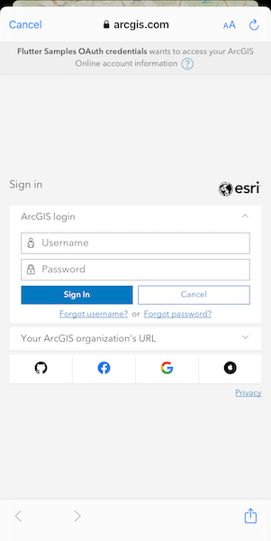
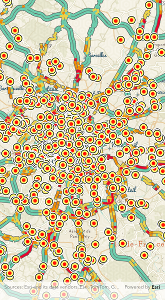

# Authenticate with OAuth

Authenticate with ArcGIS Online (or your own portal) using OAuth2 to access secured resources (such as private web maps or layers). Accessing secured items requires logging in to the portal that hosts them (an ArcGIS Online account, for example).

## Use case

Your app may need to access items that are only shared with authorized users. For example, your organization may host private data layers or feature services that are only accessible to verified users. You may also need to take advantage of premium ArcGIS Online services, such as geocoding or routing services, which require a named user login.

## How to use the sample

When you run the sample, the app will load a web map which contains premium content. You will be challenged for an ArcGIS Online login to view the private layers. Enter a user name and password for an ArcGIS Online named user account (such as your ArcGIS Location Platform account). If you authenticate successfully, the traffic layer will display, otherwise the map will contain only the public basemap layer.

## How it works

1. Implement the `ArcGISAuthenticationChallengeHandler` interface to handle the challenges sent by the protected map service.
2. Set the `arcGISAuthenticationChallengeHandler` property on `AuthenticationManager`.
3. Create an `OAuthConfiguration` specifying the portal URL, client ID, and redirect URL.
4. Load a map with premium content from a `PortalItem` requiring authentication to automatically invoke the authentication challenge.
5. Use the OAuth user configuration to create and apply an `OAuthUserCredential` in response to the authentication challenge.

## Relevant API

* ArcGISAuthenticationChallengeHandler
* AuthenticationManager
* OAuthConfiguration
* OAuthUserCredential
* Portal
* PortalItem

## Additional information

The workflow presented in this sample works for all SAML based enterprise (IWA, PKI, Okta, etc.) & social (facebook, google, etc.) identity providers for ArcGIS Online or Portal. For more information, see the topic [Set up enterprise logins](https://doc.arcgis.com/en/arcgis-online/administer/saml-logins.htm).

For additional information on using Oauth in your app, see the topic [Authorization code flow with PKCE](https://developers.arcgis.com/documentation/mapping-apis-and-services/security/user-authentication/serverless-native-flow/).

## Tags

authentication, cloud, credential, OAuth, portal, security
