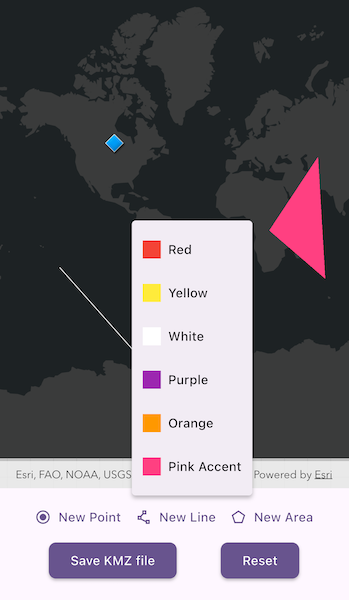

# Create and save KML file

Construct a KML document and save it as a KMZ file.

## Use case

If you need to create and save data on the fly, you can use KML to create points, lines, and polygons by sketching on the map, customizing the style, and serializing them as KML nodes in a KML Document. Once complete, you can share the KML data with others that are using a KML reading application, such as ArcGIS Earth.

## How to use the sample

Select an icon or color from the New Point, New Line, or New Area menus to start adding a geometry. Tap on the map view to place vertices, then tap the "Save Sketch" button to add the geometry to the KML document as a new KML placemark. When you are finished adding KML nodes, tap the "Save KMZ file" button and choose a name and location to save the active KML document as a .kmz file. Use the "Reset" button to clear the current KML document and start a new one.

## How it works

1. Create a `KmlDocument`
2. Create a `KmlDataset` using the `KmlDocument`.
3. Create a `KmlLayer` using the `KmlDataset` and add it to `ArcGISMap.operationalLayers`.
4. Create `Geometry` using `GeometryEditor`.
5. Project that `Geometry` to WGS84 using `GeometryEngine.project`.
6. Create a `KmlGeometry` object using that projected `Geometry`.
7. Create a `KmlPlacemark` using the `KmlGeometry`.
8. Add the `KmlPlacemark` to the `KmlDocument`.
9. Set the selected `KmlStyle` for the `KmlPlacemark`.
10. When finished with adding `KmlPlacemark` nodes to the `KmlDocument`, save the `KmlDocument` to a file using the `KmlNode.saveAs` method.

## Relevant API

* GeometryEditor
* GeometryEngine
* KmlDataset
* KmlDocument
* KmlGeometry
* KmlLayer
* KmlNode
* KmlPlacemark
* KmlStyle

## Tags

Keyhole, KML, KMZ, OGC
