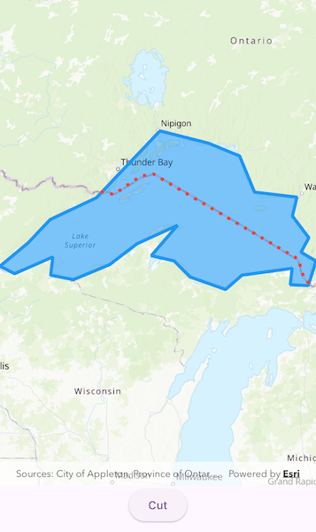

# Cut geometry

Cut a geometry along a polyline.

## Use case

You might cut a polygon representing a large parcel to subdivide it into smaller parcels.

## How to use the sample

Tap on the "Cut" button to cut the polygon with the polyline and see the resulting parts (shaded in different colors).

Tap on the "Reset" button to restore the original state.

## How it works

1. Pass the geometry and polyline to `GeometryEngine.cut` to cut the geometry along the polyline.
2. Loop through the returned list of part geometries. Some of these geometries may be multi-part.

## Relevant API

* GeometryEngine.cut
* Polygon
* Polyline

## Tags

cut, geometry, split
