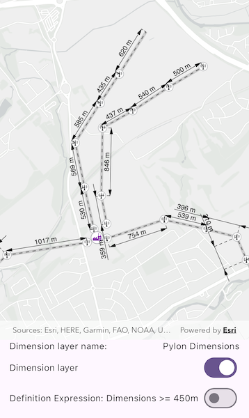

# Display dimensions

Display dimension features from a mobile map package.

## Use case

Dimensions show specific lengths or distances on a map. A dimension may indicate the length of a land parcel, or the distance between two features, such as a fire hydrant and the corner of a building.

## How to use the sample

When the sample loads, it will automatically display the map containing dimension features from the mobile map package. The name of the dimension layer containing the dimension features is displayed in the controls box. Control the visibility of the dimension layer with the "Dimension Layer visibility" switch, and apply a definition expression to show dimensions greater than or equal to 450m in length using the "Definition Expression" switch.

**Note**: the minimum scale range of the sample is set to 1:35000 to maintain readability of the dimension features.

## How it works

1. Create a `MobileMapPackage` specifying the path to the .mmpk file.
2. Load the mobile map package (mmpk) with `mmpk.load()`.
3. After the mmpk successfully loads, get the map from the mmpk `map = mmpk.maps.first`.
4. Loop through the map's layers to find the `DimensionLayer` and get the layer name to display on the UI with `DimensionLayer.name`.
5. Add the map to the map view: `mapViewController.arcGISMap = map`
6. Control the dimension layer's visibility with `DimensionLayer.isVisible = <bool>` and set a definition expression with `DimensionLayer.definitionExpression = <String>`.

## Relevant API

* DimensionLayer
* MobileMapPackage

## About the data

This sample shows a subset of the network of pylons, substations, and power lines around Edinburgh, Scotland within a [Edinburgh Pylon Dimensions mobile map package](https://arcgis.com/home/item.html?id=f5ff6f5556a945bca87ca513b8729a1e). The data was digitised from satellite imagery and is intended to be used for illustrative purposes only.

## Additional information

Dimension layers can be taken offline from a feature service hosted on ArcGIS Enterprise 10.9 or later, using the `GeodatabaseSyncTask`. Dimension layers are also supported in mobile map packages or mobile geodatabases created in ArcGIS Pro 2.9 or later.

## Tags

definition expression, dimension, distance, layer, length, mmpk, mobile map package, utility
