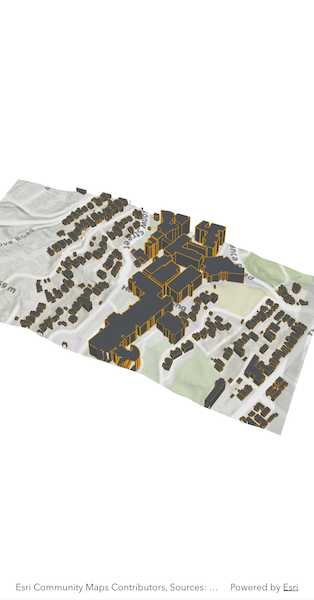

# Display local scene

Display a local scene with a topographic surface and 3D scene layer clipped to a local area.

## Use case

An `ArcGISLocalSceneView` is a user interface that displays 3D basemaps and layer content described in a `Scene` with a local `SceneViewingMode`. 

Unlike a global scene which is drawn on a globe using a geographic coordinate system, a local scene is drawn on a flat surface and supports projected coordinate systems. They are generally used to view local data and are often clipped to a specific area of interest. Currently, `ArcGISLocalSceneView` cannot display data provided by a global scene and `ArcGISSceneView` cannot display data provided by a local scene.

The `ArcGISLocalSceneView` displays the clipped area of the local scene, supports user interactions such as pan and zoom, and provides access to the underlying scene data.

## How to use the sample

When loaded, the sample will display a local scene clipped to a extent. Pan and zoom to explore the scene.

## How it works

1. Create a local scene object with the `ArcGISScene.withBasemapStyle(BasemapStyle.arcGISTopographic, viewingMode: SceneViewingMode.local)` constructor.
2. Create an `ArcGISTiledElevationSource` object and add it to the local scene's base surface.
3. Create an `ArcGISSceneLayer` and add it to the local scene's operational layers.
4. Create an Envelope and set it to the `scene.clippingArea` then enable clipping by setting `scene.isClippingEnabled` to `true`.
5. Create a `ArcGISLocalSceneView` object to display the scene.
6. Set the initial viewpoint for the local scene.
7. Set the local scene to the local scene view.

## Relevant API

* ArcGISLocalSceneView
* ArcGISScene
* ArcGISSceneLayer
* ArcGISTiledElevationSource

## Tags

3D, basemap, elevation, scene, surface
