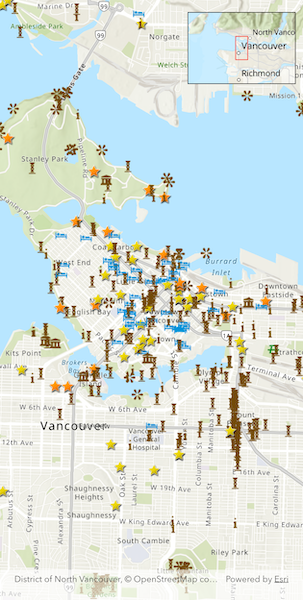

# Display overview map

Include an overview or inset map as an additional map view to show the wider context of the primary view.

## Use case

An overview map provides a useful, smaller-scale overview of the current map view's location. For example, when you need to inspect a layer with many features while remaining aware of the wider context of the view, use an overview map to help show the extent of the main map view.

## How to use the sample

Pan or zoom across the map view to browse through the tourist attractions feature layer and notice the viewpoint and scale of the linked overview map update automatically.

## How it works

1. Create an `ArcGISMap` with the `arcGISTopographic` basemap style and add it to the `ArcGISMapViewController`.
2. Instantiate a `FeatureLayer` from a `ServiceFeatureTable` and append it to the `ArcGISMap`'s operational layers.
3. In the user interface, add an `OverviewMap` widget from the ArcGIS Maps SDK for Flutter Toolkit.
4. Provide the `ArcGISMapViewController` to the `controllerProvider` property of the `OverviewMap` to connect the `ArcGISMap` with the `OverviewMap`.

## Relevant API

* ArcGISMapView
* OverviewMap

## About the data

The data used in this sample is the [OpenStreetMap Tourist Attractions for North America](https://www.arcgis.com/home/item.html?id=addaa517dde346d1898c614fa91fd032) feature layer, which is scale-dependent and displays at scales larger than 1:160,000.

## Additional information

This sample uses the OverviewMap toolkit component, which requires the [toolkit](https://pub.dev/packages/arcgis_maps_toolkit). For information about setting up the toolkit, as well as code for the underlying component, visit the [toolkit repository](https://github.com/Esri/arcgis-maps-sdk-flutter-toolkit).

## Tags

context, inset, map, minimap, overview, preview, small scale, toolkit, view
