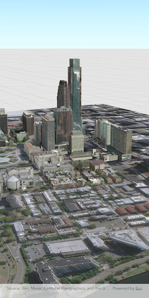

# Display scene from mobile scene package

Opens and displays a scene from a Mobile Scene Package (.mspk).

## Use case

An .mspk file is an archive containing the data (specifically, basemaps and features), used to display an offline 3D scene.

## How to use the sample

When the sample opens, it will automatically display the Scene in the Mobile Scene Package.

## How it works

This sample takes a Mobile Scene Package that was created in ArcGIS Pro, and displays an `ArcGISScene` from within the package in an `ArcGISSceneView`.

1. Create a `MobileScenePackage` using the path to the local .mspk file.
2. Call `MobileScenePackage.load()` to load the mobile scene package.
3. When the `MobileScenePackage` is loaded, obtain the first `ArcGISScene` from the `MobileScenePackage.scenes` property.
4. Create an `ArcGISSceneViewController` and set the scene from the package to the `ArcGISSceneViewController.arcGISScene` property.

## Relevant API

* ArcGISSceneView
* MobileScenePackage

## Offline data

The sample downloads a [Mobile Scene Package of Philadelphia, Pennsylvania](https://www.arcgis.com/home/item.html?id=7dd2f97bb007466ea939160d0de96a9d) from ArcGISOnline. The data was authored in ArcGIS Pro.

## Tags

offline, scene
