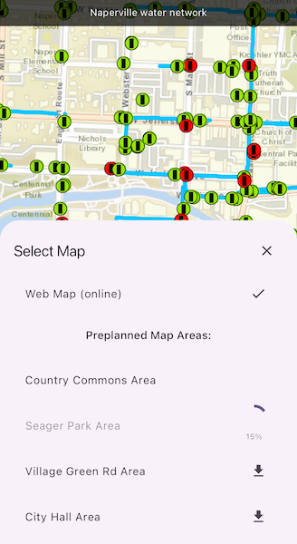

# Download preplanned map area

Take a map offline using a preplanned map area.

## Use case

Generating offline maps on demand for a specific area can be time consuming for users and a processing load on the server. If areas of interest are known ahead of time, a web map author can pre-create packages for these areas. This way, the generation only needs to happen once, making the workflow more efficient for users and servers.

An archeology team could define preplanned map areas for dig sites which can be taken offline for field use.

## How to use the sample

Tap the "Select Map" button to view a list of the available preplanned map areas. Tap a list item to initiate a download of the associated area. The download progress will be shown in the list. Once a download is complete, tap the list item again to display the offline map in the map view.

## How it works

1. Open the online `ArcGISMap` from a `PortalItem` and display it.
2. Create an `OfflineMapTask` using the portal item.
3. Get the `PreplannedMapArea`s from the task, and then load them.
4. To download a selected map area, create the default `DownloadPreplannedOfflineMapParameters` from the task using the selected preplanned map area.
5. Set the update mode of the preplanned map area.
6. Use the parameters and a download path to create a `DownloadPreplannedOfflineMapJob` from the task.
7. Start the job. Once it has completed, get the `DownloadPreplannedOfflineMapResult`.
8. Get the `ArcGISMap` from the result and display it in the `ArcGISMapView`.

## Relevant API

* DownloadPreplannedOfflineMapJob
* DownloadPreplannedOfflineMapParameters
* DownloadPreplannedOfflineMapResult
* OfflineMapTask
* PreplannedMapArea

## About the data

The [Naperville stormwater network map](https://arcgisruntime.maps.arcgis.com/home/item.html?id=acc027394bc84c2fb04d1ed317aac674) is based on ArcGIS Solutions for Stormwater and provides a realistic depiction of a theoretical stormwater network.

## Additional information

`PreplannedUpdateMode` can be used to set the way the preplanned map area receives updates in several ways:

* `noUpdates` - No updates will be performed. This mode is intended for when a static snapshot of the data is required, and it does not create a replica. This is the mode used for this sample.
* `syncWithFeatureServices` - Changes, including local edits, will be synced directly with the underlying feature services. This is the default update mode.
* `downloadScheduledUpdates` - Scheduled, read-only updates will be downloaded from the online map area and applied to the local mobile geodatabases.

For more information about offline workflows, see [Offline maps, scenes, and data](https://developers.arcgis.com/documentation/mapping-apis-and-location-services/offline/) in the *ArcGIS Developers* guide.

## Tags

map area, offline, pre-planned, preplanned
