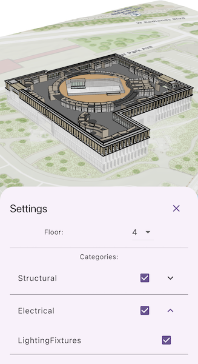

# Filter building scene layer

Explore details of a building scene by using filters and sublayer visiblity.

## Use case

Buildings in a building scene layer can be very complex models composed of sublayers containing internal and external features of the structure. Sublayers may include structural components like columns, architectural components like floors and windows, and electrical components. 

Applying filters to the building scene layer can highlight features of interest in the model. Filters are made up of filter blocks, which contain several properties that allow control over the filter's function. Setting the filter mode to X-Ray for instance, will render features with a semi-transparent white color so other interior features can be seen. In addition, toggling the visibility of sublayers can show or hide all the features of a sublayer.

## How to use the sample

In the filter controls, select floor and category options to filter what parts of the building scene layer are displayed in the scene. Click on any of the building features to identify them.

## How it works

1. Create an `ArcGISScene` with the URL to a building scene layer service.
2. Create an `ArcGISLocalSceneView` and add the scene.
3. Retrieve the `BuildingSceneLayer` from the scene's operational layers.
4. Click the "Scene Settings" button to view the filtering options.
5. Select a floor from the "Floor" dropdown to view the internal details of each floor or "All" to view the entire model.
6. Expand the categories to show or hide individual items in the building model. The entire category may be shown or hidden as well.
7. Click on any of the building features to view the attributes of the feature.

## Relevant API

* ArcGISLocalSceneView
* ArcGISScene
* BuildingComponentSublayer
* BuildingFilter
* BuildingFilterBlock
* BuildingSceneLayer

## About the data

This building scene layer represents Building E on the Esri Campus in Redlands CA.

The Revit BIM model was brought into ArcGIS using the BIM capabilities in ArcGIS Pro and published to the web as a Building Scene Layer.

## Tags

3D, building scene layer, layers
