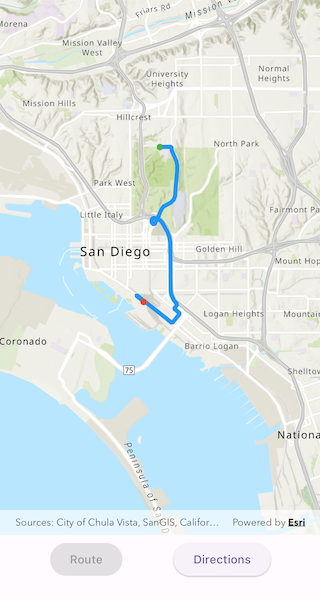
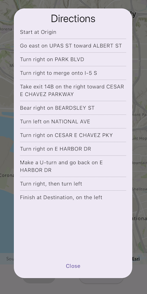

# Find route

Display directions for a route between two points.

## Use case

Find routes with driving directions between any number of locations. You might use the ArcGIS platform to create a custom network for routing on private roads.

## How to use the sample

For simplicity, the sample comes loaded with a start and end stop. You can tap on the "Route" button to display a route between these stops. Once the route is generated, tap on the "Directions" button to show turn-by-turn directions in a dialog.

## How it works

1. Create a `RouteTask` using a URL to an online route service.
2. Generate default `RouteParameters` using `routeTask.createDefaultParameters()`.
3. Set `returnStops` and `returnDirections` on the parameters to true.
4. Add `Stop`s to the parameters `stops` collection for each destination.
5. Solve the route using `routeTask.solveRoute(routeParameters)` to get a `RouteResult`.
6. Iterate through the result's `routes` property, which contains a list of `ArcGISRoute` objects. To display the route, create a graphic using the geometry from `route.routeGeometry`. To display directions, use `route.directionManeuvers`, and for each `DirectionManeuver`, display `DirectionManeuver.directionText`.

## Relevant API

* ArcGISRoute
* DirectionManeuver
* RouteParameters
* RouteResult
* RouteTask
* Stop

## Tags

directions, driving, navigation, network, network analysis, route, routing, shortest path, turn-by-turn
