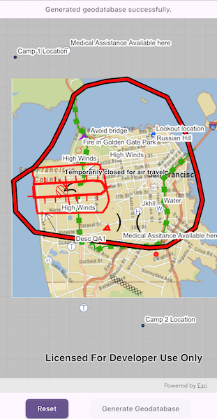

# Generate geodatabase replica from feature service

Generate a local geodatabase replica from an online feature service.

## Use case

Generating geodatabase replica is the first step toward taking a feature service offline. It allows you to save features locally for offline display.

## How to use the sample

Zoom to any extent. Then click the generate button to generate a geodatabase of features from a feature service filtered to the current extent. A red outline will show the extent used. The job's progress is shown while the geodatabase is generated. When complete, the map will reload with only the layers in the geodatabase, clipped to the extent.

## How it works

1. Create a `GeodatabaseSyncTask` with the URL of the feature service and load it.
2. Create `GenerateGeodatabaseParameters` specifying the extent and whether to include attachments.
3. Create a `GenerateGeodatabaseJob` with `geodatabaseSyncTask.generateGeodatabase(parameters: parameters, pathToGeodatabaseFileUri: geodatabaseFileUri)` and start it with `job.run()`.
4. When the job is done, `job.run()` will return the geodatabase. Inside the geodatabase are feature tables which can be used to add feature layers to the map.
5. Call `syncTask.unregisterGeodatabase(geodatabase)` after generation when you're not planning on syncing changes to the service.

## Relevant API

* GenerateGeodatabaseJob
* GenerateGeodatabaseParameters
* Geodatabase
* GeodatabaseSyncTask

## Offline data

[San Francisco offline tile package](https://www.arcgis.com/home/item.html?id=e4a398afe9a945f3b0f4dca1e4faccb5)

## About the data

The basemap uses an offline tile package of San Francisco. The online feature service has features with wildfire information.

## Tags

disconnected, local geodatabase, offline, replica, sync
