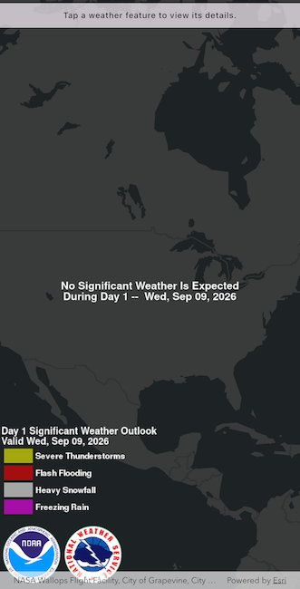

# Identify KML features

Show a callout with formatted content for a KML feature.

## Use case

A user may wish to select a KML feature to view relevant information about it.

## How to use the sample

Tap a feature to identify it. Feature information will be displayed in a callout.

Note: the KML layer used in this sample contains a screen overlay. The screen overlay contains a legend and the logos for NOAA and the NWS. You can't identify the screen overlay.

## How it works

1. Create a `KmlDataset` from the forecast URL and use it to create a `KmlLayer`.
2. Add the layer to an `ArcGISMap` and load it.
3. Configure an `onTap` handler on the `ArcGISMapView`.
4. Call `ArcGISMapViewController.identifyLayer` with the KML layer, tapped screen point, and a tolerance.
5. Get the first `KmlPlacemark` from the result and convert its `balloonContent` HTML to styled Flutter text.
6. Convert the tapped screen point to a map location and display the formatted content with `ArcGISMapViewController.callout.showAt`.

Note: There are several types of KML features. This sample only identifies features of type `KmlPlacemark`.

## Relevant API

* ArcGISMapView
* ArcGISMapViewController.callout
* ArcGISMapViewController.identifyLayer
* IdentifyLayerResult
* KmlDataset
* KmlLayer
* KmlPlacemark
* KmlPlacemark.balloonContent

## About the data

This sample shows a forecast for significant weather within the U.S. Regions of severe thunderstorms, flooding, snowfall, and freezing rain are shown. Tap the features to see details.

## Additional information

KML features can have rich HTML content, including images.

## Tags

keyhole, KML, KMZ, NOAA, NWS, OGC, weather
