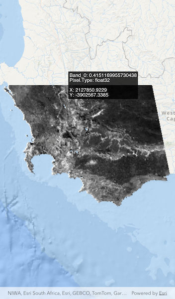

# Identify raster cell

Get the cell value of a local raster at the tapped location and display the result in a callout.

## Use case

## How to use the sample

Tap an area of the raster to identify it and see the raw raster cell information displayed in a renderer. Tap and hold to see cell information updated dynamically as you drag.

## How it works

1. Get the screen point on the map where a user tapped or long pressed and dragged from the `ArcGISMapView`.
2. On tap:
  * Call `ArcGISMapViewController.identifyLayer(...)` passing in the screen point, tolerance, and maximum number of results per layer.
  * Await the result of the identify and then get the `GeoElement` from the layer result.
  * Create a `SimpleRenderer` at the calculated map point and populate the content with text from the `GeoElement.attributes`.

## Relevant API

* ArcGISMapViewController.identifyLayer(...)
* GeoElement
* GeoElement.attributes(...)
* Raster
* RasterLayer

## About the data

The data shown is an NDVI classification derived from MODIS imagery between 27 Apr 2020 and 4 May 2020. It comes from the [NASA Worldview application](https://worldview.earthdata.nasa.gov/). In a normalized difference vegetation index, or [NDVI](https://en.wikipedia.org/wiki/Normalized_difference_vegetation_index), values range between -1 and +1 with the positive end of the spectrum showing green vegetation.

## Tags

band, cell, cell value, continuous, discrete, identify, NDVI, pixel, pixel value, raster
