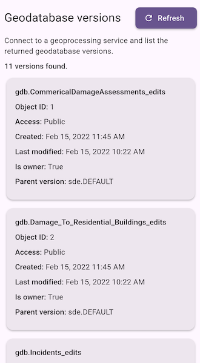

# List geodatabase versions

Connect to a service and list versions of the geodatabase.

## Use case

As part of a multi-user editing scenario, you can check with the server to see
how many versions of the geodatabase are outstanding before syncing.

## How to use the sample

When the sample loads, a list of geodatabase versions and their properties is
displayed. Tap **Refresh** to run the geoprocessing task again and reload the
latest version information from the service.

## How it works

1. Create a `GeoprocessingTask` that points to a `GPServer` with a
   `ListVersions` task.
2. Use the task to create the default `GeoprocessingParameters`.
3. Create a `GeoprocessingJob` from the parameters and run it.
4. Get the `GeoprocessingResult` from the completed job.
5. Read the `Versions` output parameter as `GeoprocessingFeatures`.
6. Convert each returned feature's attributes into displayable version
   metadata.

## Relevant API

* GeoprocessingFeatures
* GeoprocessingJob
* GeoprocessingParameters
* GeoprocessingResult
* GeoprocessingTask

## About the data

The sample uses a [sample geoprocessing service](https://sampleserver6.arcgisonline.com/arcgis/rest/services/GDBVersions/GPServer/ListVersions)
hosted on ArcGIS Online.

## Additional information

ArcGIS Server does not include a geoprocessing service for listing geodatabase
versions. You must configure one using the steps defined in
[Geoprocessing service example: list, create, and delete geodatabase versions](https://desktop.arcgis.com/en/arcmap/latest/analyze/sharing-workflows/gp-service-example-list-create-and-delete-geodatabase-versions.htm)
in the *ArcMap* documentation.

## Tags

conflict resolution, data management, database, multi-user, sync, version
