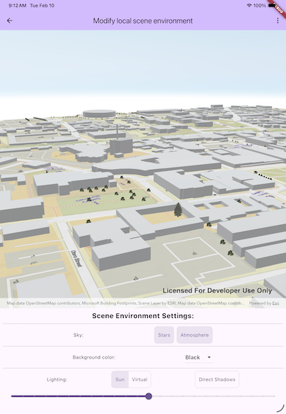

# Modify local scene environment

Modify the environment settings in a local scene to change the lighting conditions and background appearance.

## Use case

Environment settings for a LocalSceneView define how the background or sky appears, if objects in the scene cast shadows, and if virtual lighting or simulated sunlight is used to light the scene.

By activating sun lighting, a user can visualize how shadows are cast throughout the day. If the atmosphere and stars are active, the blue sky will show during daylight hours, and a realistic star field will show at night.

Alternatively, a scene may be rendered using a virtual light source, with shadows disabled, and with a simple solid background color in place of the sky. The virtual light source is slightly offset from the camera instead of a time-based location.

## How to use the sample

At start-up, you will see a local scene with a set of scene environment controls at the bottom. Adjusting the controls will change how the scene is rendered in real time.

### Background settings

Toggling the “Stars” and “Atmosphere” buttons will enable or disable those features. Selecting a color from the dropdown will set a solid color for the background color.

Some notes about the behavior of the sky and background:

* The atmosphere is rendered in front of the stars and the stars are in front of the background color.
* Stars are not rendered when using virtual lighting.
* To fully see the background color, atmosphere and stars must be deactivated.
* The background color shows in the night sky if the atmosphere is enabled and the stars are disabled.

### Lighting settings

The lighting buttons switch between sun lighting and virtual lighting. The “Direct Shadows” button will enable or disable the rendering of shadows for 3d objects in the scene. Shadows are not rendered for surface terrain. If sun lighting is active, the slider under the buttons will set the hour of the day ranging from midnight to 11pm (23:00). Dragging the bar will change the position of the simulated Sun causing changes to shading and direct shadows.

## How it works

When the sample is started, a `ArcGISScene` is loaded from an online resource and applied to the `ArcGISLocalSceneViewController.arcGISScene` property. The sample’s controls are updated to reflect the current state of the scene’s environment property.

Changes to the settings in the background controls set values directly on the `SceneEnvironment` object.

* `isAtmosphereEnabled` and `areStarsEnabled` are boolean properties dictating whether the atmosphere and star field are visible.
* Colors selected from the dropdown are set to the `backgroundColor`.

Changes to the settings in the lighting controls manipulate the `SceneLighting` object in the `SceneEnvironment.lighting` property.

* Switching between “Sun” and “Virtual” lighting assigns a new `SunLighting` or `VirtualLighting` object to the lighting property.
* The “Direct Shadows” button sets the `areDirectShadowsEnabled` boolean property on the lightning object. This toggles the shadows cast by object in the scene.
* If `SunLighting` is active, manipulating the slider changes the hour of the `simulatedDate` property on the lighting object. `VirtualLighting` does not have a date time property so the slider is disabled.

## Relevant API

* ArcGISLocalSceneView
* ArcGISScene
* SceneEnvironment
* SceneLighting
* SunLighting
* VirtualLighting

## About the data

The [web scene](https://maps.arcgis.com/home/item.html?id=fcebd77958634ac3874bbc0e6b0677a4) used for this sample contains a clipped local scene consisting of a surface and 3D objects representing the buildings. The scene is located in Santa Fe, New Mexico, USA.

## Tags

3D, environment, lighting, scene
