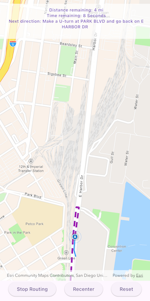

# Navigate route

Use a routing service to navigate between two points.

## Use case

Navigation is often used by field workers while traveling between two points to get live directions based on their location.

## How to use the sample

Tap 'Start Routing' to simulate traveling and to receive directions from a preset starting point to a preset destination. Tap 'Reset' to start the simulation from the beginning.

## How it works

1. Create a `RouteTask` using a URL to an online route service.
2. Generate default `RouteParameters` using `routeTask.createDefaultParameters()`.
3. Set `returnStops` and `returnDirections` on the parameters to true.
4. Add `Stop`s to the parameters `stops` collection for each destination.
5. Solve the route using `routeTask.solveRoute(routeParameters)` to get a `RouteResult`.
6. Create a `RouteTracker` using the route result, and the index of the desired route to take.
7. Create a `RouteTrackerLocationDataSource` with the route tracker and simulated location data source to snap the location display to the route.
8. Subscribe to `RouteTracker.onTrackingStatusChanged` and use the `TrackingStatus` to display updated route information. Tracking status includes a variety of information on the route progress, such as the remaining distance, remaining geometry or traversed geometry (represented by a `Polyline`), or the remaining time (`double`), amongst others.
9. Subscribe to `RouteTracker.onNewVoiceGuidance` to get the `VoiceGuidance` whenever new instructions are available. From the voice guidance, get the `String` representing the directions and use a text-to-speech engine to output the maneuver directions.
10. You can also query the tracking status for the current `DirectionManeuver` index, retrieve that maneuver from the `Route` and get it's direction text to display in the GUI.
11. To establish whether the destination has been reached, get the `DestinationStatus` from the tracking status. If the destination status is `reached`, and the `remainingDestinationCount` is 1, we have arrived at the destination and can stop routing. If there are several destinations in your route, and the remaining destination count is greater than 1, switch the route tracker to the next destination.

## Relevant API

* DestinationStatus
* DirectionManeuver
* Location
* LocationDataSource
* ReroutingStrategy
* Route
* RouteParameters
* RouteTask
* RouteTracker
* Stop
* VoiceGuidance

## About the data

The route taken in this sample goes from the San Diego Convention Center, site of the annual Esri User Conference, to the Fleet Science Center, San Diego.

## Tags

directions, maneuver, navigation, route, turn-by-turn, voice
