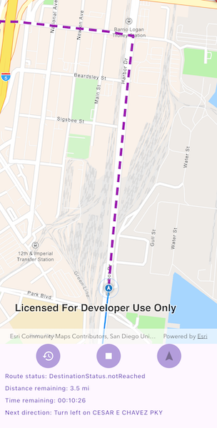

# Navigate route with rerouting

Navigate between two points and dynamically recalculate an alternate route when the original route is unavailable.

## Use case

While traveling between destinations, field workers use navigation to get live directions based on their locations. In cases where a field worker makes a wrong turn, or if the route suggested is blocked due to a road closure, it is necessary to calculate an alternate route to the original destination.

## How to use the sample

Click the 'Play' button to simulate travel and receive directions from a preset starting point to a preset destination. Observe how the route is recalculated if the simulation deviates from the suggested path. You should hear voice directions when maneuver instructions are available. You can stop or restart the simulated movement and recenter the navigation.

## How it works

1. Create a `RouteTask` using the downloaded `Geodatabase`.
2. Generate default `RouteParameters` using `routeTask.createDefaultParameters()`.
3. Set `returnStops` and `returnDirections` on the parameters to true.
4. Add `Stop`s to the parameters `stops` collection for each destination.
5. Solve the route using `routeTask.solve(routeParameters)` to get a `RouteResult`.
6. Create a `RouteTracker` using the route result, and the index of the desired route to take.
7. Enable rerouting in the route tracker with `.enableRerouting(RouteTask, RouteParameters, ReroutingStrategy, false)`. The Boolean specifies `visitFirstStopOnStart` and is false by default. Use `ReroutingStrategy.toNextWaypoint` to specify that in the case of a reroute the new route goes from present location to next waypoint or stop.
8. Use `RouteTrackerLocationDataSource` to track the location of the device and update the route tracking status.
9. Add a listener to capture `onTrackingStatusChanged`, and then get the `TrackingStatus` and use it to display updated route information. Tracking status includes a variety of information on the route progress, such as the remaining distance, remaining geometry or traversed geometry (represented by a `Polyline`), or the remaining time (`Double`), amongst others.
10. Add a `onNewVoiceGuidance` to get the `VoiceGuidance` whenever new instructions are available. From the voice guidance, get the `String` representing the directions and use a text-to-speech engine to output the maneuver directions.
11. You can also query the tracking status for the current `DirectionManeuver` index, retrieve that maneuver from the `Route` and get its direction text to display in the GUI.
12. To establish whether the destination has been reached, get the `DestinationStatus` from the tracking status. If the destination status is `REACHED`, and the `remainingDestinationCount` is 1, you have arrived at the destination and can stop routing. If there are several destinations in your route, and the remaining destination count is greater than 1, switch the route tracker to the next destination.

## Relevant API

* DestinationStatus
* DirectionManeuver
* Location
* LocationDataSource
* ReroutingStrategy
* Route
* RouteParameters
* RouteTask
* RouteTracker
* Stop
* VoiceGuidance

## Offline data

A JSON file provides a simulated path for the device to demonstrate routing while traveling.

Link     |
---------|
|[Navigate a Route JSON Track](https://www.arcgis.com/home/item.html?id=4caec8c55ea2463982f1af7d9611b8d5)|

## About the data

The route taken in this sample goes from the San Diego Convention Center, site of the annual Esri User Conference, to the Fleet Science Center, San Diego.

## Additional information

The route tracker will start a rerouting calculation automatically as necessary when the device's location indicates that it is off-route. The route tracker also validates that the device is "on" the transportation network, if it is not (e.g. in a parking lot) rerouting will not occur until the device location indicates that it is back "on" the transportation network.

## Tags

directions, maneuver, navigation, route, turn-by-turn, voice
