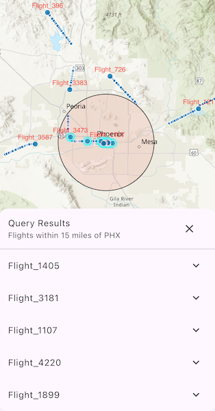

# Query dynamic entities

Find dynamic entities from a data source that match a query.

## Use case

Developers can query a `DynamicEntityDataSource` to find dynamic entities that meet spatial and/or
attribute criteria. The query returns a collection of dynamic entities matching the
`DynamicEntityQueryParameters` or track IDs at the moment the query is executed.

An example of this is a flight tracking app that monitors airspace near a particular airport,
allowing the user to monitor flights based on different criteria such as arrival airport or flight
number.

## How to use the sample

Tap **Query Flights** button and choose one of the query options. After the query completes, a list of matching flights is shown. Expand a flight to see its latest attributes update in real-time.

## How it works

1. Create a `DynamicEntityDataSource` to stream dynamic entity events.
2. Create `DynamicEntityQueryParameters` and set its properties:
   * To spatially filter results, set `geometry` and `spatialRelationship`.
   * To query entities with certain attribute values, set `whereClause`.
3. To perform a dynamic entities query, call `DynamicEntityDataSource.queryDynamicEntities` to query with spatial and/or attribute filters, or call `DynamicEntityDataSource.queryDynamicEntitiesByTrackIds` if you want to query *only* by track IDs.
4. When complete, get the dynamic entities from the result using `DynamicEntityQueryResult.iterator()`.
5. Use `DynamicEntity.onDynamicEntityChanged` to receive change notifications.
6. Get the new observation from `DynamicEntityChangedInfo.receivedObservation` and use `dynamicEntityPurged` to determine whether a dynamic entity has been purged.

## Relevant API

* DynamicEntity
* DynamicEntityChangedInfo
* DynamicEntityDataSource
* DynamicEntityLayer
* DynamicEntityObservation
* DynamicEntityQueryParameters
* DynamicEntityQueryResult

## Offline data

This sample uses [PHX Air Traffic JSON](https://www.arcgis.com/home/item.html?id=c78e297e99ad4572a48cdcd0b54bed30).
It is downloaded from ArcGIS Online as part of the sample.

## About the data

This sample uses the [PHX Air Traffic JSON](https://www.arcgis.com/home/item.html?id=c78e297e99ad4572a48cdcd0b54bed30)
portal item, which is hosted on ArcGIS Online and downloaded automatically. The file contains JSON
data for mock air traffic around the Phoenix Sky Harbor International Airport in Phoenix, AZ, USA.
The decoded data is used to simulate dynamic entity events through a
`CustomDynamicEntityDataSource`, which is displayed on the map with a `DynamicEntityLayer`.

## Additional information

A dynamic entities query is performed on the most recent observation of each dynamic entity in the data source at the time the query is executed. As entities change, they may no longer match the original query parameters.

## Tags

data, dynamic, entity, live, query, real-time, search, stream, track
