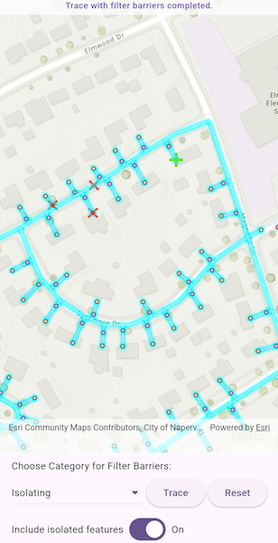

# Run valve isolation trace

Run a filtered trace to locate operable features that will isolate an area from the flow of network resources.

## Use case

Determine the set of operable features required to stop a network's resource, effectively isolating an area of the network. For example, you can choose to return only accessible and operable valves: ones that are not paved over or rusted shut.

## How to use the sample

Tap on one or more features to use as filter barriers or create and set the configuration's filter barriers by selecting a category. Check or uncheck 'Include Isolated Features'. Tap 'Trace' to run a subnetwork-based isolation trace. Tap 'Reset' to clear filter barriers.

## How it works

1. Create a new `ArcGISMapView` and subscribe to its `onTap` event.
2. Create and load a `ArcGISMap` with a web map portal item that contains a `UtilityNetwork`.
3. Load the `UtilityNetwork` from the `ArcGISMap`.
4. Create `UtilityTraceParameters` with `UtilityTraceType.isolation` and a starting location from a given asset type and global ID.
5. Get a default `UtilityTraceConfiguration` from a given tier in a domain network to set `UtilityTraceParameters.traceConfiguration`.
6. Add a `GraphicsOverlay` with a `Graphic` that represents this starting location; and another `GraphicsOverlay` for filter barriers.
7. Populate the choice list for the 'Filter Barrier: Category exists' from `UtilityNetworkDefinition.categories`.
8. When the MapView is tapped, identify which features are at the tap location and add a `Graphic` that represents a filter barrier.
9. Create a `UtilityElement` for the identified feature and add this `UtilityElement` to a collection of filter barriers.
      * If the element is a junction with more than one terminal, display a terminal picker. Then set the junction's `Terminal` property with the selected terminal.
      * If an edge, set its `fractionAlongLine` property using `GeometryEngine.fractionAlong`.  
10. If `Trace` is tapped without filter barriers:
      * Create a new `UtilityCategoryComparison` with the selected category and `UtilityCategoryComparisonOperator.exists`.
      * Create a new `UtilityTraceFilter` with this condition as `Barriers` to set `Filter` and update `includeIsolatedFeatures` properties of the default configuration from step 5.
      * Run a `UtilityNetwork.trace(parameters)`.

    If `Trace` is tapped with filter barriers:
      * Update `includeIsolatedFeatures` property of the default configuration from step 5.
      * Run a `UtilityNetwork.trace(parameters)`.
11. For every `FeatureLayer` in the map, select the features returned with `getFeaturesForElements(elements)` from the elements matching their `NetworkSource.featureTable` with the layer's `FeatureTable`.

## Relevant API

* GeometryEngine.fractionAlong
* ServiceGeodatabase
* UtilityCategory
* UtilityCategoryComparison
* UtilityCategoryComparisonOperator
* UtilityDomainNetwork
* UtilityElement
* UtilityElementTraceResult
* UtilityNetwork
* UtilityNetworkDefinition
* UtilityTerminal
* UtilityTier
* UtilityTraceFilter
* UtilityTraceParameters
* UtilityTraceResult
* UtilityTraceType

## About the data

The [Naperville gas](https://sampleserver7.arcgisonline.com/server/rest/services/UtilityNetwork/NapervilleGas/FeatureServer) network feature service contains a utility network used to run the isolation trace shown in this sample. Authentication is required and handled within the sample code.

## Additional information

Using utility network on ArcGIS Enterprise 10.8 requires an ArcGIS Enterprise member account licensed with the [Utility Network user type extension](https://enterprise.arcgis.com/en/portal/latest/administer/windows/license-user-type-extensions.htm#ESRI_SECTION1_41D78AD9691B42E0A8C227C113C0C0BF). Please refer to the [utility network services documentation](https://enterprise.arcgis.com/en/server/latest/publish-services/windows/utility-network-services.htm).

## Tags

category comparison, condition barriers, filter barriers, isolated features, network analysis, subnetwork trace, trace configuration, trace filter, utility network
