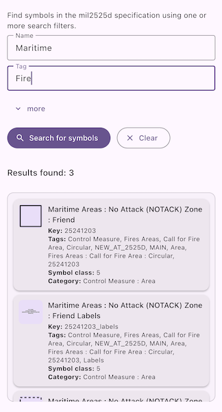

# Search symbol style dictionary

Find symbols within the mil2525d specification that match a keyword.

## Use case

You can use support for military symbology to allow users to report changes in the field using the correct military symbols.

## How to use the sample

By default, leaving the fields blank and hitting search will find all symbols.

To search for certain symbols, enter text into one or more search boxes and click 'Search for symbols'. Results are shown in a list. Pressing 'Clear' will reset the search.

## How it works

1. Create a symbol dictionary with the mil2525d specification by passing the string "mil2525d" and the path to a .stylx file to the `SymbolStyle.withStyleLocation` method.
2. Create `StyleSymbolSearchParameters`.
3. Add members to the `names`, `tags`, `symbolClasses`, `categories`, and `keys` list fields of the search parameters.
4. Search for symbols using the parameters with `symbolStyle.searchSymbols(styleSymbolSearchParameters)`.
5. Get the `Symbol` from the list of returned `StyleSymbolSearchResult`s.

## Relevant API

* Symbol
* SymbolDictionary
* SymbolStyleSearchParameters
* SymbolStyleSearchResult

## Additional information

This sample features the mil2525D specification. ArcGIS Maps SDK supports other military symbology standards, including mil2525C and mil2525B(change 2). See the [Military Symbology Styles](https://solutions.arcgis.com/defense/help/military-symbology-styles/) overview on *ArcGIS Solutions for Defense* for more information about support for military symbology.

## Tags

CIM, defense, look up, MIL-STD-2525B, MIL-STD-2525C, MIL-STD-2525D, mil2525b, mil2525c, mil2525d, military, military symbology, search, symbology
