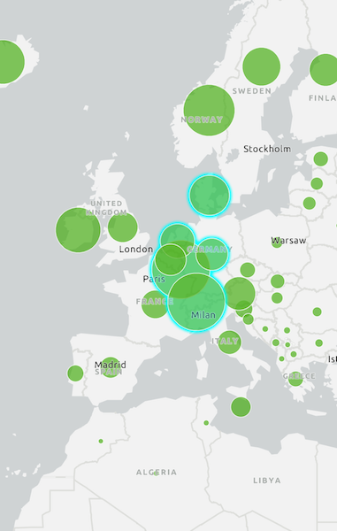

# Select features in feature layer

Select features in a feature layer.

## Use case

Selecting features, whether by query or identify, can be an important step both in editing data and visualizing results. One possible use case would be to query a feature layer containing street furniture. A query might look for type "bench" and return a list of bench features contained in the features with an attribute of type bench. These might be selected for further editing (see FeatureQueryResult) or may just be highlighted visually.

## How to use the sample

Tap on a feature in the map. All features within a given tolerance (in pixels) of the tap will be selected.

## How it works

1. Create a `ServiceFeatureTable` from a feature service URL.
2. Create a `FeatureLayer` from the service feature table.
3. Identify nearby features at the tapped location using `identifyLayer(featureLayer, screenPoint, tolerance, maximumResults)` on the map view.
4. Select all identified features in the feature layer with `selectFeatures(features)`.

## Relevant API

* Feature
* FeatureLayer
* ServiceFeatureTable

## About the data

This sample uses the [Gross Domestic Product, 1960-2016](https://www.arcgis.com/home/item.html?id=0c4b6b70a56b40b08c5b0420c570a6ac) feature service. Only the 2016 GDP values are shown.

## Tags

features, layers, select, selection, tolerance
