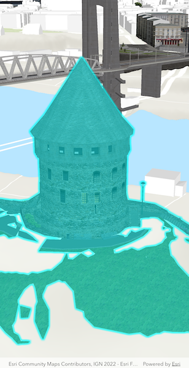

# Select features in scene layer

Identify features in a scene to select.

## Use case

You can select features to visually distinguish them with a selection color or highlighting. This can be useful to demonstrate the physical extent or associated attributes of a feature, or to initiate another action such as centering that feature in the scene view.

## How to use the sample

Tap on a building in the scene layer to select it. Deselect buildings by tapping away from the buildings.

## How it works

1. Create an `ArcGISSceneLayer` passing in the URL to a scene layer service.
2. Use `onTap` callback of the `ArcGISSceneView` to get the screen tap location `screenPoint`.
3. Call `ArcGISSceneViewController.identifyLayer(sceneLayer, screenPoint, tolerance, false, 1)` to identify features in the scene.
4. From the resulting `IdentifyLayerResult`, get the list of identified `GeoElements` with `result.geoElements`.
5. Get the first element in the list, checking that it is a feature, and call `sceneLayer.selectFeature(feature)` to select it.

## Relevant API

* ArcGISScene
* ArcGISSceneLayer
* ArcGISSceneView

## About the data

This sample shows a [Berlin, Germany Scene](https://www.arcgis.com/home/item.html?id=31874da8a16d45bfbc1273422f772270) hosted on ArcGIS Online.

## Tags

3D, Berlin, buildings, identify, model, query, search, select
