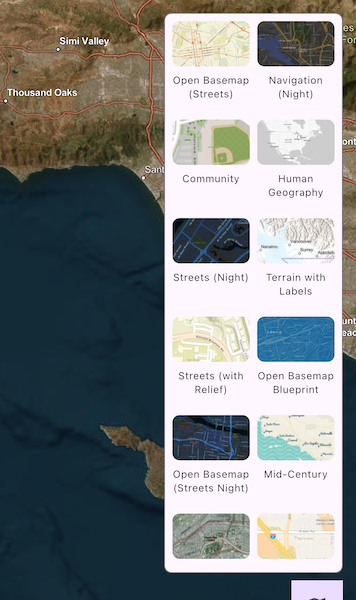

# Set basemap

Change a map's basemap. A basemap is beneath all layers on a map and is used to provide visual reference for the operational layers.

## Use case

Basemaps should be selected contextually. For example, in maritime applications, it would be more appropriate to use a basemap of the world's oceans as opposed to a basemap of the world's streets.

## How to use the sample

Tap the map button to show or hide the basemap gallery. Select a basemap in the gallery to apply it to the map.

## How it works

1. Create an `ArcGISMap` object with an initial basemap style.
2. Set the map to the `ArcGISMapViewController` object.
3. Create a `BasemapGalleryController` and set the map to the `geoModel` property.
4. Create a `BasemapGallery` widget using the `BasemapGalleryController`.

## Relevant API

* ArcGISMap
* ArcGISMapViewController
* Basemap
* BasemapGallery
* BasemapGalleryController

## Additional information

This sample uses the `BasemapGallery` toolkit component from the ArcGIS Maps SDK for Flutter Toolkit. The component supports selecting 2D and 3D basemaps from ArcGIS Online, a user-defined portal, or a collection of basemaps.

## Tags

basemap, map
