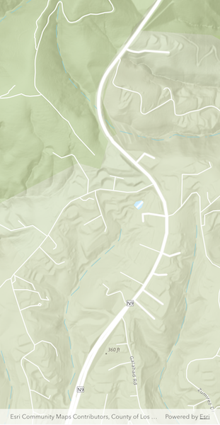

# Set initial viewpoint

Display the map at an initial viewpoint representing a bounding geometry.

## Use case

Setting the initial viewpoint is useful when a user wishes to first load the map at a particular area of interest.

## How to use the sample

When the sample loads, note the map is opened at the initial view point that is set to it.

## How it works

1. Instantiate an `ArcGISMap` object.
2. Instantiate a `Viewpoint` object using an `Envelope` object.
3. Set the starting location of the map with `initialViewpoint`.
4. Set the map to an `ArcGISMapView` object.

## Relevant API

* ArcGISMap
* ArcGISMapView
* Envelope
* Viewpoint

## Tags

envelope, extent, initial viewpoint, zoom
