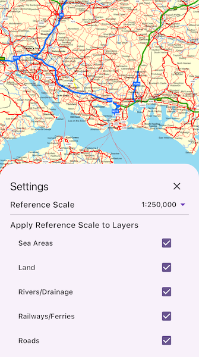

# Set reference scale

Set the map's reference scale and which feature layers should honor the reference scale.

## Use case

Setting a reference scale on an `ArcGISMap` fixes the size of symbols and text to the desired height and width at that scale. As you zoom in and out, symbols and text will increase or decrease in size accordingly. When no reference scale is set, symbol and text sizes remain the same size relative to the `ArcGISMapView`.

Map annotations are typically only relevant at certain scales. For instance, annotations to a map showing a construction site are only relevant at that construction site's scale. So, when the map is zoomed out that information shouldn't scale with the `ArcGISMapView`, but should instead remain scaled with the `ArcGISMap`.

## How to use the sample

Tap the "Settings" button to load the settings dialog. Use the drop-down menu to set the map's reference scale (1:500,000 1:250,000 1:100,000 1:50,000). You can choose which feature layers should honor the reference scale using the checkboxes. Tap the "Set to Reference Scale" button to set the map scale to the reference scale.

## How it works

1. Get and set the reference scale property on the `ArcGISMap` object.
2. Get and set the scale symbols property on each individual `FeatureLayer` object.

## Relevant API

* ArcGISMap
* FeatureLayer

## Additional information

The map reference scale should normally be set by the map's author and not exposed to the end user like it is in this sample.

## Tags

map, reference scale, scene
