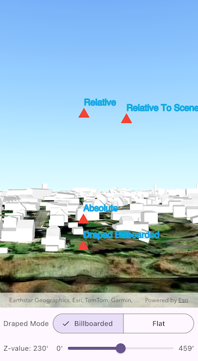

# Set surface placement mode

Position graphics relative to a surface using different surface placement modes.

## Use case

Depending on the use case, data might be displayed at an absolute height (e.g. flight data recorded with altitude information), at a relative height to the terrain (e.g. transmission lines positioned relative to the ground), at a relative height to objects in the scene (e.g. extruded polygons, integrated mesh scene layer), or draped directly onto the terrain (e.g. location markers, area boundaries).

## How to use the sample

The application loads a scene showing four points that use individual surface placement modes (Absolute, Relative, Relative to Scene, and either Draped Billboarded or Draped Flat). Use the toggle to change the draped mode and the slider to dynamically adjust the Z value of the graphics. Explore the scene by zooming in/out and by panning around to observe the effects of the surface placement rules.

## How it works

1. Create a `GraphicsOverlay` for each `SurfacePlacement` mode:
    * `absolute`, positions graphics using only their Z value.
    * `relative`, positions graphics using their Z value plus the elevation of the surface.
    * `drapedBillboarded`, positions graphics upright on the surface and always facing the camera.
    * `drapedFlat`, positions graphics flat on the surface.
    * `relativeToScene`, positions graphics using their Z value plus the elevation of scene content.
2. Set the surface placement mode using `GraphicsOverlay.sceneProperties.surfacePlacement`.
3. Add a marker graphic and text label to each graphics overlay.
4. Add each graphics overlay to the scene view using `ArcGISSceneViewController.graphicsOverlays.add(overlay)`.
5. Update the graphics geometries when the slider changes to apply a new Z value to all graphics.

## Relevant API

* Graphic
* GraphicsOverlay
* GraphicsOverlay.sceneProperties
* SurfacePlacement

## About the data

The scene launches with a view of Brest, France. Four points are shown hovering with positions defined by each of the different surface placement modes.

## Additional information

This sample uses an elevation service to add elevation/terrain to the scene. Graphics are positioned relative to that surface for the `drapedBillboarded`, `drapedFlat`, and `relative` surface placement modes. It also uses a scene layer containing 3D models of buildings. Graphics are positioned relative to that scene layer for the `relativeToScene` surface placement mode.

## Tags

3D, absolute, altitude, draped, elevation, floating, relative, scenes, sea level, surface placement
