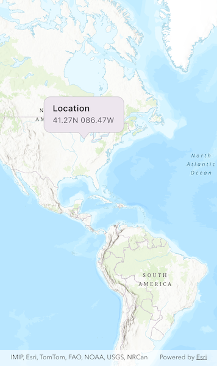

# Show callout

Show a callout with the latitude and longitude of user-tapped points.

## Use case

Callouts are used to display temporary detail content on a map. You can display text and arbitrary UI controls in callouts.

## How to use the sample

Tap anywhere on the map. A callout showing the WGS84 coordinates for the tapped point will appear.

## How it works

1. Create an `ArcGISMap` and set it on an `ArcGISMapView`.
2. Configure an `onTap` event handler on the `ArcGISMapView`.
3. Project the tapped location to WGS84 using `GeometryEngine.project`.
4. Display the tapped location’s coordinates in a callout with `ArcGISMapViewController.callout.showAt`.

## Relevant API

* ArcGISMapView
* ArcGISMapViewController.callout
* GeometryEngine.project

## Tags

balloon, bubble, callout, flyout, flyover, info window, popup, tap
