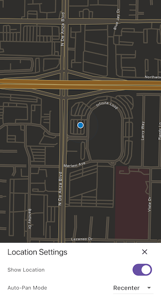

# Show device location

Display your current position on the map, as well as switch between different types of auto pan modes.

## Use case

When using a map within a GIS, it may be helpful for a user to know their own location within a map, whether that's to aid the user's navigation or to provide an easy means of identifying/collecting geospatial information at their location.

## How to use the sample

Tap the button in the lower right (which starts in Stop mode). A menu will appear with the following options:

* Stop - Stops the location display.
* On - Starts the location display with no AutoPanMode mode set.
* Re-Center - Starts the location display with `autoPanMode` set to `recenter`.
* Navigation - Starts the location display with `autoPanMode` set to `navigation`.
* Compass - Starts the location display with `autoPanMode` set to `compassNavigation`.

## How it works

1. Create an `ArcGISMapView`.
2. Get the `LocationDisplay` object from the `locationDisplay` property on the controller.
3. Use `start()` and `stop()` on the `LocationDisplay` object as necessary.

## Relevant API

* ArcGISMap
* ArcGISMapView
* LocationDisplay
* LocationDisplay.autoPanMode

## Additional information

Location permissions are required for this sample.

## Tags

compass, GPS, location, map, mobile, navigation
