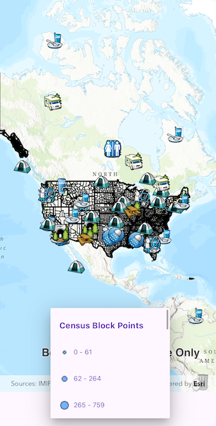

# Show legend

Build a legend for all the operational layers in the map.

## Use case

Legends are used to describe what each symbol on a map represents. A common format is to show an image of the symbol alongside of a text description of what that symbol represents. This sample demonstrates how a simple legend can be built up in code using the `LayerContent` interface.

## How to use the sample

1. Open the sample
2. Flick through the legend control to see the various elements that represent features on the map.

## How it works

1. Layers implement the `LayerContent` interface, which contain a list of `LegendInfo`. `LegendInfo` contains a `Symbol` and a name string. `layer.fetchLegendInfos()` must be called on each `Layer` instance to fetch the info from the data.
2. For each symbol in the `LegendInfo` list, `symbol.createSwatch()` must be called so that an image of the `Symbol` is returned.
3. The names and images are then displayed next to each other in a list view UI control.

## Relevant API

* LayerContent
* LegendInfo

## Additional information

This sample uses the legend toolkit component, which requires the toolkit to be cloned and set up locally. Visit the repository for information about setting up the toolkit, platform availabilty, as well as code for the underlying component.

## Tags

legend, legend info, symbol swatch, toolkit
