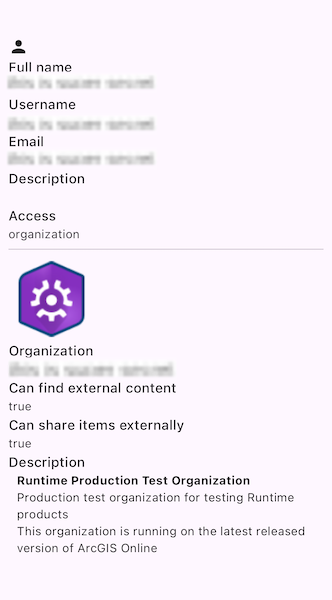

# Show portal user info

Retrieve a user's details via a Portal.

## Use case

This portal information can be used to provide a customized UI experience for the user. For example, you can show a thumbnail next to their username in the header of an application to indicate that they are currently logged in. Additionally, apps such as Collector and Explorer use this functionality to integrate with Portal.

## How to use the sample

When prompted, enter your ArcGIS Online credentials.

## How it works

1. An authentication challenge handler is set on `ArcGISEnvironment.authenticationManager`.
2. A `Portal` is created, using `PortalConnection.authenticated` to require authentication.
3. The portal is loaded, which triggers an authentication challenge.
4. The `ArcGISAuthenticationChallengeHandler` callback is called to handle the authentication challenge.
5. The OAuth login process is triggered using `OAuthUserCredential.create()`.

If the portal is successfully loaded, the `portalUser` property is used to populate a series of fields including:

* fullName
* username
* email
* description
* access

Similarly, the `portalInfo` property is used to populate:

* organizationName
* organizationDescription
* thumbnailUrl
* canSearchPublic
* canSharePublic

## Relevant API

* ArcGISAuthenticationChallengeHandler
* AuthenticationManager
* OAuthUserCredential
* PortalInfo
* PortalUser

## About the data

This sample signs into your ArcGIS Online account and displays the user's profile information.

## Tags

account, avatar, bio, cloud and portal, email, login, picture, profile, user, username
