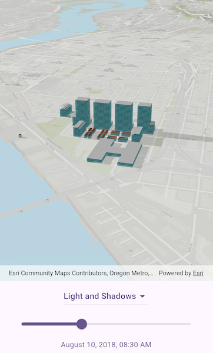

# Show realistic light and shadows

Show realistic lighting and shadows for a given time of day.

## Use case

You can use realistic lighting to evaluate the shadow impact of buildings and utility infrastructure on the surrounding community. This could be useful for civil engineers and urban planners, or for events management assessing the impact of building shadows during an outdoor event.

## How to use the sample

Select one of the three lighting options to show that lighting effect on the scene view. Select a time of day from the slider (based on a 24hr clock) to show the lighting for that time of day in the scene view.

## How it works

1. Create an `ArcGISScene` and display it in a `ArcGISSceneView`.
2. Create a `DateTime` to define the time of day.
3. Set the sun time property to that DataTime with `ArcGISSceneViewController.sunTime`.
4. Set the lighting mode of the ArcGIS SceneView to **no light**, **light**, or **light and shadows** with `ArcGISSceneViewController.sunLighting = LightingMode`.

## Relevant API

* ArcGISScene
* ArcGISSceneViewController.sunLighting
* ArcGISSceneViewController.sunTime
* LightingMode

## Tags

3D, lighting, realism, realistic, rendering, shadows, sun, time
