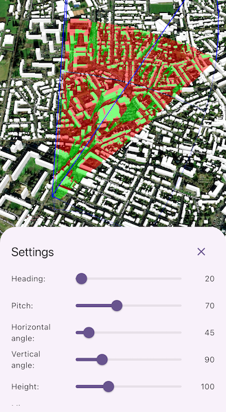

# Show viewshed from point in scene

Perform a viewshed analysis from a defined vantage point.

## Use case

A 3D viewshed analysis is a type of visual analysis you can perform on a scene. The viewshed shows what can be seen from a given location. The output is an overlay with two different colors - one representing the visible areas (green) and the other representing the obstructed areas (red). Viewshed analysis is a form of "exploratory analysis", which means the results are calculated on the current scale of the data, and the results are generated very quickly. If more "conclusive" results are required, consider using a `GeoprocessingTask` to perform a viewshed instead.

## How to use the sample
Tap a location on the map to change the location of the viewshed observation point.

Tap the "Settings" button at the bottom of the screen to show the controls to change the viewshed settings. The rendered viewshed will update in real time as the values are adjusted.

## How it works

1. Create a `LocationViewshed` passing in the observer location, heading, pitch, horizontal/vertical angles, and min/max distances.
2. Set the property values on the viewshed instance for location, direction, range, and visibility properties.

## Relevant API

* AnalysisOverlay
* ArcGISSceneLayer
* ArcGISTiledElevationSource
* LocationViewshed
* Viewshed

## About the data

The scene shows a [buildings layer in Brest, France](https://www.arcgis.com/home/item.html?id=b343e14455fe45b98a2c20ebbceec0b0) hosted on ArcGIS Online.

## Tags

3D, frustum, scene, viewshed, visibility analysis
