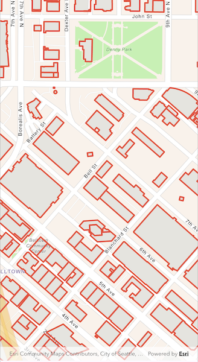

# Show WFS layer from URL

Display a layer from a WFS service using data from URL

## Use case

WFS is an open standard with functionality similar to ArcGIS feature services. ArcGIS Maps SDK support for WFS allows you to interoperate with open systems, which are often used in inter-agency efforts, like those for disaster relief.

## How to use the sample

Pan and zoom to see features within the current map extent.

## How it works

1. Create a `WfsFeatureTable` with a URL.
2. Create a `FeatureLayer` from the feature table and add it to the map.
3. Listen for the `ArcGISMapViewController.onNavigatonChanged` event to detect when the navigation is complete.
4. When the user is finished navigating, use `WfsFeatureTable.populateFromService` to load the table with data for the current visible extent.

## Relevant API

* ArcGISMapView
* ArcGISMapViewController.onNavigationChanged
* FeatureLayer
* WfsFeatureTable
* WfsFeatureTable.populateFromService

## About the data

This service shows building footprints for downtown Seattle. For additional information, see the underlying service on [ArcGIS Online](https://arcgisruntime.maps.arcgis.com/home/item.html?id=1b81d35c5b0942678140efc29bc25391).

## Tags

browse, catalog, feature, interaction cache, layers, OGC, service, web, WFS
