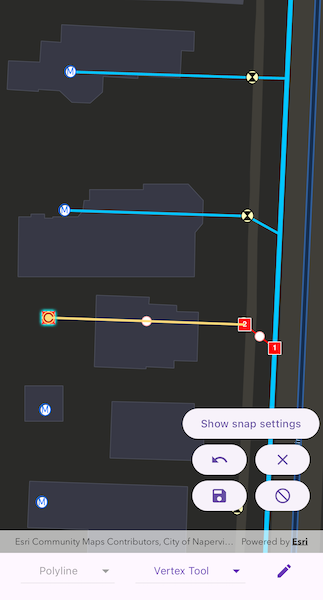

# Snap geometry edits

Use the Geometry Editor to edit a geometry and align it to existing geometries on a map.

## Use case

A field worker can create new features by editing and snapping the vertices of a geometry to existing features on a map. In a water distribution network, service line features can be represented with the polyline geometry type. By snapping the vertices of a proposed service line to existing features in the network, an exact footprint can be identified to show the path of the service line and what features in the network it connects to. The feature layer containing the service lines can then be accurately modified to include the proposed line.

## How to use the sample

To create a geometry, tap the create button to choose the geometry type you want to create (i.e. points, multipoints, polyline, or polygon) and interactively tap and drag on the map view to create the geometry.

Snap settings can be configured by enabling and disabling snapping, feature snapping, geometry guides and snap sources.

To interactively snap a vertex to a feature or graphic, ensure that snapping is enabled for the relevant snap source and drag a vertex to nearby an existing feature or graphic. When the vertex is close to that existing geoelement, the edit position will be adjusted to coincide with (or snap to), edges and vertices of its geometry. Release to place the vertex at the snapped location.

To edit a geometry, tap the geometry to be edited in the map to select it and then edit the geometry by tapping and dragging its vertices and snapping them to nearby features or graphics.

To undo changes made to the geometry, tap the undo button.

To delete a geometry or a vertex, tap the geometry or vertex to select it and then tap the delete button.

To save your edits, tap the save button.

## How it works

1. Create an `ArcGISMap` from the `URL` and connect it to the `ArcGISMapView` via the `ArcGISMapViewController`.
2. Set the map's `loadSettings.featureTilingMode` to `enabledWithFullResolutionWhenSupported`.
3. Create a `GeometryEditor` and connect it to the map view controller.
4. Call `syncSourceSettings` after the map's operational layers are loaded and the geometry editor has connected.
5. Set `snapSettings.isEnabled` and `snapSourceSettings.isEnabled` to true for the `SnapSource` of interest.
6. Toggle geometry guides using `snapSettings.isGeometryGuidesEnabled` and feature snapping using `snapSettings.isFeatureSnappingEnabled`.
7. Start the geometry editor with a `GeometryType`.

## Relevant API

* ArcGISMapView
* FeatureLayer
* Geometry
* GeometryEditor
* GeometryEditorStyle
* GraphicsOverlay
* SnapSettings
* SnapSource
* SnapSourceSettings

## About the data

The [Naperville water distribution network](https://www.arcgis.com/home/item.html?id=b95fe18073bc4f7788f0375af2bb445e) is based on ArcGIS Solutions for Water Utilities and provides a realistic depiction of a theoretical stormwater network.

## Additional information

Snapping is used to maintain data integrity between different sources of data when editing, so it is important that each `SnapSource` provides full resolution geometries to be valid for snapping. This means that some of the default optimizations used to improve the efficiency of data transfer and display of polygon and polyline layers based on feature services are not appropriate for use with snapping.

To snap to polygon and polyline layers, the recommended approach is to set the `FeatureLayer`'s feature tiling mode to `FeatureTilingMode.enabledWithFullResolutionWhenSupported` and use the default `ServiceFeatureTable` feature request mode `FeatureRequestMode.onInteractionCache`. Local data sources, such as geodatabases, always provide full resolution geometries. Point and multipoint feature layers are also always full resolution.

Snapping can be used during interactive edits that move existing vertices using the `VertexTool` or `ReticleVertexTool`. Using the `ReticleVertexTool` to add and move vertices allows users of touch screen devices to clearly see the visual cues for snapping.

Geometry guides are enabled by default when snapping is enabled. These allow for snapping to a point coinciding with, parallel to, perpendicular to or extending an existing geometry.

## Tags

edit, feature, geometry editor, graphics, layers, map, snapping
