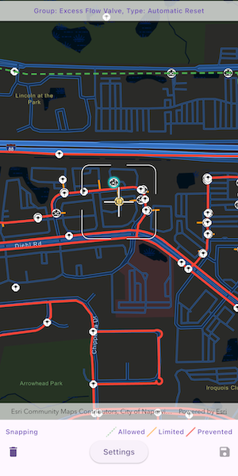

# Snap geometry edits with utility network rules

Use the Geometry Editor to edit geometries using utility network connectivity rules.

## Use case

A field worker can create new features in a utility network by editing and snapping the vertices of a geometry to existing features on a map. In a gas utility network, gas pipeline features can be represented with the polyline geometry type. Utility networks use geometric coincident-based connectivity to provide pathways for resources. Rule-based snapping uses utility network connectivity rules when editing features based on their asset type and asset group to help maintain network connectivity.

## How to use the sample

To edit a geometry, tap a point geometry to be edited in the map to select it. Then edit the geometry by tapping the button to start the geometry editor.

Snap sources can be enabled and disabled. Snapping will not occur when `SnapRuleBehavior.rulesPreventSnapping` even when the source is enabled.

To interactively snap a vertex to a feature or graphic, ensure that snapping is enabled for the relevant snap source, then move the reticle or drag a vertex to nearby an existing feature or graphic. If the existing feature or graphic has valid utility network connectivity rules for the asset type that is being created or edited, the edit position will be adjusted to coincide with (or snap to) edges and vertices of its geometry. Release the touch pointer to place the vertex at the snapped location.

To discard changes and stop the geometry editor, tap the discard button.

To save your edits, tap the save button.

## How it works

1. Create a map with `LoadSettings.featureTilingMode` set to `enabledWithFullResolutionWhenSupported`.
2. Create a `Geodatabase` using the mobile geodatabase file location.
3. Display `Geodatabase.featureTables` on the map using subtype feature layers.
4. Create a `GeometryEditor` and connect it to the map view.
5. When editing a feature:

    a. Call `SnapRules.createFromAssetType()` to get the snap rules associated with a given `UtilityAssetType`.

    b. Use `syncSourceSettingsUsingRules(SnapRules, SnapSourceEnablingBehavior.setFromRules)` to populate the `SnapSettings.sourceSettings` with `SnapSourceSettings` enabling the sources with rules.

6. Start the geometry editor with an existing geometry or `GeometryType.point`.

## Relevant API

* ArcGISMapView
* FeatureLayer
* Geometry
* GeometryEditor
* GeometryEditorStyle
* GraphicsOverlay
* SnapRuleBehavior
* SnapRules
* SnapSettings
* SnapSource
* SnapSourceEnablingBehavior
* SnapSourceSettings
* UtilityNetwork

## About the data

The [Naperville gas network](https://www.arcgis.com/home/item.html?id=0fd3a39660d54c12b05d5f81f207dffd) mobile geodatabase contains a utility network with a set of connectivity rules that can be used to perform geometry edits with rules based snapping.

## Tags

edit, feature, geometry editor, graphics, layers, map, snapping, utility network
