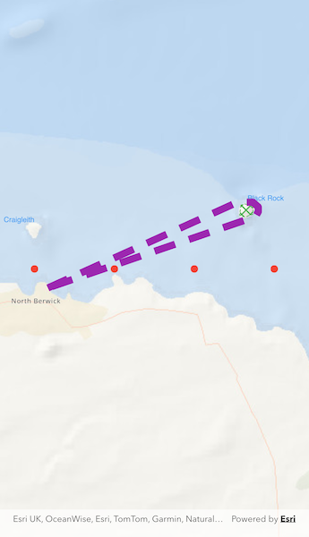

# Style graphics with symbols

Use a symbol style to display a graphic on a graphics overlay.

## Use case

Allows you to customize a graphic by assigning a unique symbol. For example, you may wish to display
individual graphics for different landmarks across a region, and to style each one with a unique
symbol.

## How to use the sample

Pan and zoom around the map. Observe the graphics on the map.

## How it works

1. Create a `GraphicsOverlay` and add it to the `ArcGISMapView`.
2. Create a `ArcGISSymbol` such as `SimpleMarkerSymbol`, `SimpleLineSymbol` or `SimpleFillSymbol`.
3. Create a `Graphic`, specifying a `Geometry` and a `ArcGISSymbol`.
4. Add the `Graphic` to the `GraphicsOverlay`.

## Relevant API

* Geometry
* Graphic
* GraphicsOverlay
* SimpleFillSymbol
* SimpleLineSymbol
* SimpleMarkerSymbol

## Tags

display, fill, graphics, line, marker, overlay, point, symbol
