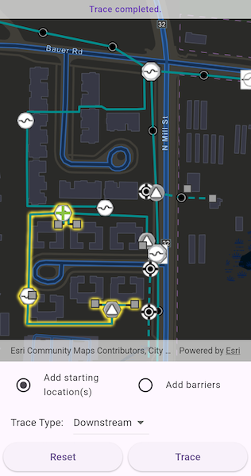

# Trace utility network

Discover connected features in a utility network using connected, subnetwork, upstream, and downstream traces.

## Use case

You can use a trace to visualize and validate the network topology of a utility network for quality assurance. Subnetwork traces are used for validating whether subnetworks, such as circuits or zones, are defined or edited appropriately.

## How to use the sample

Tap on one or more features while 'Add starting locations' or 'Add barriers' is selected. When a junction feature is identified, you may be prompted to select a terminal. When an edge feature is identified, the distance from the tapped location to the beginning of the edge feature will be computed. Select the type of trace using the drop down menu. Click 'Trace' to initiate a trace on the network. Tap 'Reset' to clear the trace parameters and start over.

## How it works

1. Create an `ArcGISMapView` and listen for `onTap` event.
2. Create an `ArcGISMap` with the given portal item, and set the map to the ArcGISMapView.
3. Get the only `UtilityNetwork` from the map.
4. Get and load the `ServiceGeodatabase` associated with the utility network.
5. Get the `FeatureLayer`(s) created from the `ServiceGeodatabase`'s tables.
6. Add a `GraphicsOverlay` with symbology that distinguishes starting locations from barriers.
7. Identify features on the map and add a `Graphic` that represents its purpose (starting location or barrier) at the tapped location.
8. Create a `UtilityElement` for the identified feature.
9. Determine the type of this element using its `UtilityNetworkSource.SourceType` property.
10. If the element is a junction with more than one terminal, display a terminal picker. Then set the junction's `UtilityTerminal` property with the selected terminal.
11. If an edge, set its `FractionAlongEdge` property using `GeometryEngine.FractionAlong`.
12. Add this `UtilityElement` to a collection of starting locations or barriers.
13. Create `UtilityTraceParameters` with the selected trace type along with the collected starting locations and barriers (if applicable).
14. Set the `UtilityTraceParameters.TraceConfiguration` with the tier's `UtilityTier.getDefaultTraceConfiguration()` result.
15. Run a `UtilityNetwork.trace()` with the specified parameters.
16. For every `FeatureLayer` in the map, select the features returned with `getFeaturesForElements` from the elements matching their `UtilityNetworkSource.FeatureTable` with the layer's `FeatureTable`.

## Relevant API

* FractionAlong
* ServiceGeodatabase
* UtilityAssetType
* UtilityDomainNetwork
* UtilityElement
* UtilityElementTraceResult
* UtilityNetwork
* UtilityNetworkDefinition
* UtilityNetworkSource
* UtilityTerminal
* UtilityTier
* UtilityTraceConfiguration
* UtilityTraceParameters
* UtilityTraceResult
* UtilityTraceType
* UtilityTraversability

## About the data

The [Naperville electrical](https://sampleserver7.arcgisonline.com/server/rest/services/UtilityNetwork/NapervilleElectric/FeatureServer) network feature service contains a utility network used to run the subnetwork-based trace shown in this sample. Authentication is required and handled within the sample code.

## Additional information

Using utility network on ArcGIS Enterprise 10.8 requires an ArcGIS Enterprise member account licensed with the [Utility Network user type extension](https://enterprise.arcgis.com/en/portal/latest/administer/windows/license-user-type-extensions.htm#ESRI_SECTION1_41D78AD9691B42E0A8C227C113C0C0BF). Please refer to the [utility network services documentation](https://enterprise.arcgis.com/en/server/latest/publish-services/windows/utility-network-services.htm).

## Tags

condition barriers, downstream trace, network analysis, subnetwork trace, toolkit, trace configuration, traversability, upstream trace, utility network, validate consistency
