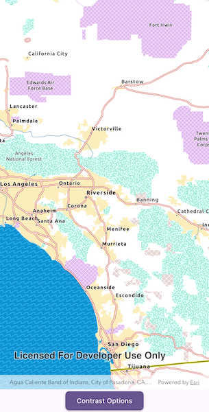

# Update basemap for contrast accessibility

Display a map view that updates between authored light, dark, and high-contrast basemaps.

## Use case

Use this pattern when your app needs contrast-responsive basemaps to switch between light, dark, and high-contrast states. This is especially useful with basemaps authored for accessibility, along with reference layers for the associated base layer.

## How to use the sample

When the sample is launched, it displays the basemap that matches the current device contrast settings. In automatic mode, changing the device appearance between light and dark theme, or turning high contrast on and off, loads the matching basemap.

Tap **Contrast Options** to show or hide the basemap's reference layers. Switch to manual mode to choose Light, Dark, High contrast light, or High contrast dark directly.

## How it works

1. Provide four authored basemaps that represent the supported contrast appearances: Light, Dark, High contrast light, and High contrast dark.
2. Resolve which contrast appearance should be active based on the current mode and device settings.
    * In manual mode, use the appearance selected in the settings bottom sheet.
    * In automatic mode, use Flutter's `MediaQuery.platformBrightness` and `MediaQuery.highContrast` values.
3. Map the resolved appearance to a `BasemapStyle` or an ArcGIS Online `Basemap` and update the map's `basemap`.
4. Apply the current reference-layer visibility setting to the basemap's labels and boundary layers.

## Relevant API

* ArcGISMap
* BasemapStyle

## About the data

This sample uses ArcGIS light and dark gray basemap styles for regular contrast, plus two ArcGIS Online enhanced contrast basemaps for high-contrast presentation states.

* [Enhanced Contrast Map](https://www.arcgis.com/home/item.html?id=084291b0ecad4588b8c8853898d72445)
* [Enhanced Contrast Dark Map](https://www.arcgis.com/home/item.html?id=3e23478909194c54992eaaee78b5f754)

The enhanced contrast basemaps are designed for accessibility-focused presentation workflows. You can use them as a starting reference for your own contrast-specific basemap workflows.

## Additional information

For more background information on the cartographic approach behind the enhanced contrast basemaps, see [Working with Enhanced Contrast basemaps to improve accessibility](https://www.esri.com/arcgis-blog/products/arcgis-living-atlas/mapping/working-with-enhanced-contrast-basemaps-to-improve-accessibility/).

## Tags

accessibility, accessible, basemap, colorblind, contrast, dark, enhanced, high, inclusive, legibility, light, living atlas, readability, vision, visual impairment, WCAG
