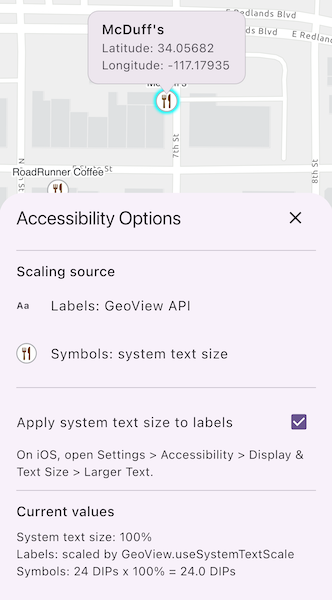

# Update labels and symbols to scale for visual accessibility

Scale feature labels and symbols according to the system text-size setting.

## Use case

Use this pattern to improve map readability for users who increase text size in their operating system's accessibility settings. Enable `GeoViewController.useSystemTextScale` to scale feature labels automatically. To scale feature symbols, observe system text-size changes and apply the reported scaling to the symbol sizes.

## How to use the sample

Change the text size in the operating system's accessibility settings to see the restaurant labels and symbols resize. On Android, use **Open system text-size settings**. On iOS, open **Settings** > **Accessibility** > **Display & Text Size** > **Larger Text**.

Clear **Apply system text size to labels** to stop labels from following the system text size, then select it again to restore system text scaling. Restaurant symbols continue to follow the system text size independently of this setting. The legend and current values show how labels and symbols are scaled.

Tap a restaurant to show its name and WGS 84 coordinates in a callout. Tap elsewhere to clear the callout.

## How it works

1. Create an `ArcGISMap` and add a `FeatureLayer`.
2. Load the `restaurant` symbol from `Esri2DPointSymbolsStyle` and apply it with a `SimpleRenderer`.
3. Load the feature layer, then add a `LabelDefinition` with a `TextSymbol`.
4. To scale labels, enable `GeoViewController.useSystemTextScale`.
5. To scale symbols, read the current text scaler with `MediaQuery.textScalerOf()` in `didChangeDependencies()` and call `scale()` with the base `MultilayerPointSymbol.size`.
6. Use the checkbox to toggle system text scaling for labels without changing symbol scaling.
7. Identify a restaurant with `identifyLayer()` and show its name and WGS 84 coordinates in a callout.

## Relevant API

* GeoViewController.useSystemTextScale

## About the data

This sample uses a [Redlands restaurants](https://www.arcgis.com/home/item.html?id=46119989eccd46a58b8f3d7aedadeb90) feature layer covering food establishments in Redlands, California. Each feature represents a single restaurant.

The restaurant symbol comes from [Esri's 2D point symbol web style](https://www.arcgis.com/home/item.html?id=220936cc6ed342c9937abd8f180e7d1e).

## Additional information

`GeoViewController.useSystemTextScale` controls system text scaling for feature labels. Flutter's `MediaQuery.textScalerOf()` supplies the current text scaling used to resize the restaurant symbols.

## Tags

accessibility, label, readability, scale, symbol, text, visual impairment
